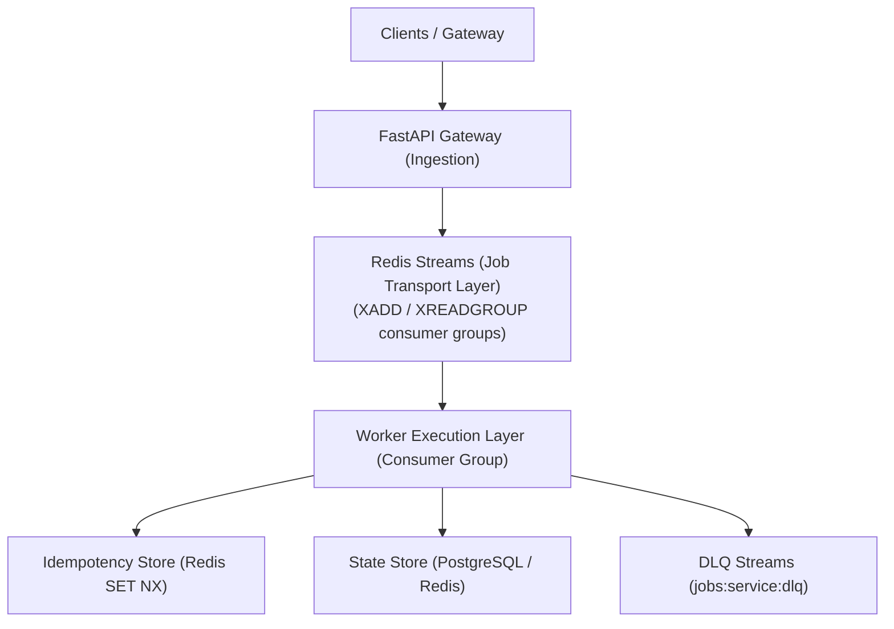

# AD. Publish
### Distributed asynchronous job execution and state coordination engine for publishing operations under failure.

> [!IMPORTANT]
> **Production Status**: Built from the ground up to guarantee operational correctness under distributed network failures, worker node crashes, and downstream API rate limiting.

* **At-Least-Once Delivery**: Native Redis Streams integration ensures zero lost messages.
* **Lease-Based Processing**: Distributed consumer locks prevent split-brain processing.
* **Checkpoint Recovery**: Microservice-level progress persistence avoids duplicate executions.
* **Fault Isolation**: Isolated Dead Letter Queues prevent cascading pipeline blocks.
* **Deterministic Backoffs**: Smart exponential backoff schedules handle transient throttling.

---

## Why Reliability Matters

In real production systems, failure is the default state:
1. **Worker Nodes Crash**: A server dies mid-execution. Traditional queues drop the job or restart it blindly. *AD. Publish* detects the lease loss, re-allocates the job, and resumes from the last database checkpoint.
2. **Downstream API Inconsistencies**: Social platform APIs timeout, disconnect, or return rate limits. *AD. Publish* classifies errors as retryable or permanent, avoiding useless retries on logical failures while executing backoffs for transient ones.
3. **Queue Redelivery & Overlap**: Distributed queue redelivery and network retry storms cause duplicate execution. *AD. Publish* isolates steps with Redis-based atomic idempotency keys, filtering duplicate side-effects.

---

## Reliability Guarantees

| Failure Mode | Coordination Strategy | Operational Outcome |
| :--- | :--- | :--- |
| **Worker node crashes mid-job** | Distributed active leasing & visibility timeouts | Job recovered and reassigned automatically via `XAUTOCLAIM` |
| **Network retries / duplicate triggers** | Atomic idempotency keys (Redis `SET NX`) | Secondary execution skipped safely at worker entry |
| **Downstream API rate limiting (429)** | Token Bucket tracking & ZSET-based backoff | Job execution pauses; resumes automatically post-cooling period |
| **Partial pipeline execution crashes** | State checkpointing (SQL `StateManager`) | Recovery worker skips completed steps and resumes progress |
| **Poison messages / logical errors** | DLQ routing & manual request replay | Failure isolated to prevent stream blocking; replayable post-fix |

---

## Architecture



* **Gateway API**: Lightweight ingestion proxy. Decouples HTTP clients by generating a UUID `job_id` and enqueuing jobs to Redis Streams.
* **Job Transport**: Redis Streams partition job execution across dynamic consumer groups, tracking pending entries in the Pending Entries List (PEL).
* **Worker Pool**: Stateless execution units running python workers. Coordinates with Redis for locks and PostgreSQL for durable state.
* **PostgreSQL StateManager**: Enforces clean database boundaries with isolated schemas per service to track progress checkpoints without database-level coupling.

---

## Job Lifecycle

```
[Client] ---> Gateway API (HTTP POST)
                 │
                 ▼  (1) Generate Job ID & Enqueue
             Redis Stream (XADD)
                 │
                 ▼  (2) Consume via XREADGROUP
             Worker Daemon
                 │
           ┌─────┴────────────────────────────────────────┐
           │ (3) Acquire Lease & Heartbeat Loop           │
           │ (4) Assert Idempotency Key (Redis SET NX)    │
           │ (5) Fetch State Checkpoint (PostgreSQL)      │
           └─────┬────────────────────────────────────────┘
                 ▼
           Step Execution Loop
           ┌─────┴────────────────────────────────────────┐
           │ (6) Run Step logic (e.g. Media Upload)       │
           │ (7) Write Checkpoint (PostgreSQL)            │
           └─────┬────────────────────────────────────────┘
                 ├─────────────────────────┐
                 ▼ (Success)               ▼ (Failure)
            [Finish & Ack]            [Exception Classification]
                 │                         │
                 ├─ (8) Update Lock (Success) ├─ (8) Transient: Backoff ZSET
                 └─ (9) XACK & XDEL        └─ (9) Permanent / Max Retries: DLQ
```

---

## Reliability Components

### Retry Strategy
* **Problem**: Downstream outages or transient network dropouts cause processing failures. Immediate retries saturate downstream systems, causing cascading failure loops.
* **Solution**: Implements a jittered exponential backoff ($1\text{s} \to 5\text{s} \to 25\text{s} \to 125\text{s}$) managed via a Redis Sorted Set (`ZSET`). Failed jobs are acknowledged on the stream to prevent blocking, and re-enqueued dynamically when their backoff expires.
* **Tradeoff**: Delayed execution schedules introduce temporary eventual consistency.

### Idempotency Model
* **Problem**: At-least-once queues guarantee delivery but invite duplicate execution. A duplicate request could cause double-posting on a social platform.
* **Solution**: Every request requires a client-supplied unique idempotency key. Workers claim the key in Redis using `SET NX` with a 24-hour TTL before execution. Subsequent duplicate runs terminate early.
* **Tradeoff**: Relies on Redis availability and client-side consistency in generating unique keys.

### Worker Leasing
* **Problem**: Worker processes can crash or get killed (SIGKILL) mid-job. Without leasing, the job stays unacknowledged in the PEL, lost forever.
* **Solution**: Workers acquire a lease lock (`job_lease:{job_id}`) and maintain it with an active background heartbeat thread. If the worker crashes, the lease expires. The autobreaker manager reclaims the job via `XAUTOCLAIM` after a visibility timeout.
* **Tradeoff**: Heartbeats increase Redis traffic; crash recovery is bound to the polling interval.

### Dead Letter Queue (DLQ)
* **Problem**: Unrecoverable failures (e.g. bad authentication credentials) block worker throughput if retried endlessly.
* **Solution**: Jobs exceeding 5 retry attempts or raising a `NonRetryableError` are removed from the queue and routed to `{service_name}:dlq`. Operators can inspect payloads and replay them using Gateway management routes.
* **Tradeoff**: Requires manual inspection and code fixes to resolve root failures.

### Partial Recovery (Checkpointing)
* **Problem**: Multi-stage operations (auth check $\to$ media storage upload $\to$ API publish) that crash at the final stage waste bandwidth and cause duplication if restarted from scratch.
* **Solution**: The `StateManager` tracks successful step completions. The worker records milestones to PostgreSQL. On retry, the worker reads the last step checkpoint and skips completed steps.
* **Tradeoff**: PostgreSQL writes introduce minor performance latency to the execution path.

### Rate Limiting
* **Problem**: Downstream social networks block accounts that exceed call frequencies.
* **Solution**: Integration adapters query a sliding-window Token Bucket rate limiter in Redis before issuing API calls, raising a `RateLimitExceeded` retryable exception when capacity is exhausted.
* **Tradeoff**: Limits maximum throughput to ensure API compliance.

### Failure Injection
* **Problem**: Resilience code pathways rot unless tested regularly under simulated chaos.
* **Solution**: A configurable `FailureSimulator` layer is embedded in workers to randomly inject execution latency, 5xx server errors, or 400 validation failures.
* **Tradeoff**: Must be strictly disabled in production via environment overrides.

---

## Design Decisions

| Decision | Reason |
| :--- | :--- |
| **Redis Streams** | Acts as a lightweight, durable transport broker with Consumer Groups without the heavy operational setup of Apache Kafka or RabbitMQ. |
| **PostgreSQL Per-Service** | Enforces clean database boundaries. State tracking and operational logging remain decoupled at the service boundary. |
| **FastAPI Async-First** | Native async/await allows high concurrency on I/O-bound proxy requests, minimizing thread overhead. |
| **At-Least-Once Delivery** | Prioritizes delivery durability under network failures over the complex distributed coordination overhead of exactly-once protocols. |
| **Application-Level Idempotency** | Handles deduplication logic directly in the worker context where state can be checked before triggering side-effects. |

---

## Failure Philosophy

1. **Design for the Crash**: Workers will crash, networks will fail, and databases will restart. Systems must accept failure as a normal state.
2. **Recovery > Prevention**: Preventing every failure is impossible. Ensuring the system can recover deterministically to a consistent state is the primary goal.
3. **Idempotency is Mandatory**: In a distributed network, at-least-once is the only realistic delivery model. Application endpoints must be designed to tolerate duplicate deliveries.
4. **State Integrity Survives Ingest**: Once a job is accepted by the Gateway, its state transition must be durable. Unacknowledged work must persist until resolved or sent to the DLQ.

---

## Technology Stack

* **Backend Framework**: FastAPI (Python 3.12+), Pydantic v2
* **Persistence Layer**: PostgreSQL 18 (AsyncSession via SQLAlchemy 2.0)
* **Messaging & Locks**: Redis Streams (Consumer Groups), Redis Key-Value Store
* **Reverse Proxy / Routing**: Traefik v3.6
* **Observability Pipeline**: OpenTelemetry, Prometheus, Grafana Loki, Tempo, Promtail
* **Testing & Tools**: Pytest, Ruff, k6 (performance smoke tests)

---

## Local Development

Ensure Docker and Compose are installed:

1. Clone the repository and navigate to the infrastructure directory:
   ```bash
   git clone https://github.com/zerexei/posexei.git
   cd posexei/infrastructure
   ```
2. Build and launch the stack:
   ```bash
   docker-compose up --build
   ```
3. Access local dashboard services:
   * **Web Interface**: `http://app.localhost`
   * **API Gateway**: `http://gateway.localhost`
   * **Grafana Telemetry**: `http://localhost:3000` (pre-provisioned with metrics, logs, and traces)

---

## API Reference

| Endpoint | Method | Payload | Description |
| :--- | :--- | :--- | :--- |
| `/health` | `GET` | None | Verify API Gateway status |
| `/users` | `POST` | `{ "username": "...", "email": "..." }` | Register user account |
| `/accounts` | `GET` | None | List connected social channel profiles |
| `/accounts` | `POST` | `{ "provider": "...", "name": "...", "page_id": "...", "access_token": "..." }` | Link a platform profile page |
| `/accounts/{account_id}` | `DELETE` | None | Disconnect and revoke account credentials |
| `/social/posts` | `POST` | `{ "page_id": "...", "provider": "...", "message": "...", "media_url": "..." }` | Enqueue an async publish job to Redis Streams |
| `/jobs/{job_id}` | `GET` | None | Retrieve status and execution results for a job |
| `/dlq/{service_name}` | `GET` | None | Inspect unrecoverable failures isolated in the DLQ |
| `/dlq/{service_name}/{message_id}/replay` | `POST` | None | Replay failed job from DLQ back to active queue |

---

## Future Improvements

* **Distributed Tracing Expansion**: Inject trace headers deeper into downstream mock workers.
* **Kubernetes Integration**: Helm charts for scaling worker deployments based on consumer lag.
* **Dynamic Priorities**: Weighted stream consumers to prioritize real-time user publishing over scheduled queues.
* **Multi-Region Recovery**: Active-passive replication strategies for Redis state stores.

---

## What This Demonstrates

For engineering managers and recruiters, this repository demonstrates:
* **Distributed System Engineering**: Hands-on experience with partition-tolerant consumers, stream checkpoints, and transactional state stores.
* **Reliability Architecture**: Concrete implementations of leases, circuit breakers, idempotency locks, and Dead Letter recovery loops.
* **Observability-Driven Design**: Integrating distributed tracing and logging across microservices to isolate async execution bottlenecks.
* **Operational Defense**: Writing code that assumes downstream systems are untrusted, slow, and prone to failures.
