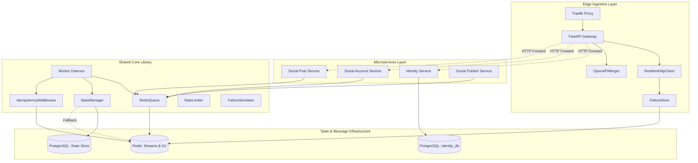
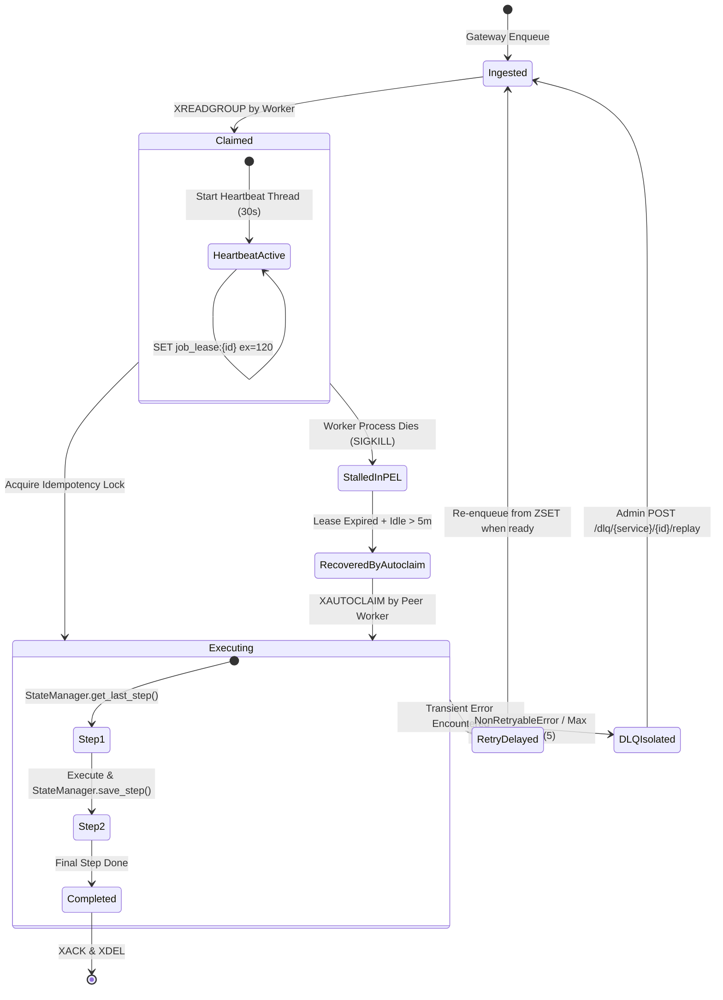

# Component Diagram & Subsystem Boundaries

## Purpose
This document specifies the exact structural relationships, component boundaries, and internal interfaces of the **AD. Publish** distributed execution platform.

---

## Component Boundaries

---

## Subsystem Descriptions

### 1. Ingestion Subsystem (`gateway/app/`)
- **`main.py`**: Initializes FastAPI application (`AD. Publish Gateway`), registers routes, and invokes `setup_openapi_merger()`.
- **`http_client.py`**: Exports `forward(service_name, method, url, request, **kwargs)` which instantiates a `ResilientHttpClient` configured with a 30s cooldown, max 3 retries, 5s timeout, 10s sliding time window, and 50% failure rate threshold.
- **`openapi_merger.py`**: Intercepts `/openapi.json` requests, queries downstream microservices (`http://identity-service:3001/openapi.json`), and merges Pydantic component schemas and endpoint routes into a unified Swagger doc.
- **`routes/v1/dlq.py`**: Provides direct administrative access to inspect (`GET /dlq/{service_name}`) and replay (`POST /dlq/{service_name}/{message_id}/replay`) dead-lettered messages in Redis Streams.

### 2. Core Worker Engine (`services/shared/shared/`)
- **`Worker` (`worker.py`)**: Stateless daemon class responsible for polling Redis Streams via `XREADGROUP`, maintaining active heartbeat leases in Redis (`job_lease:{message_id}`), handling retry exponential backoffs (1s -> 5s -> 25s -> 125s), and claiming orphan messages via `XAUTOCLAIM`.
- **`RedisQueue` (`queue.py`)**: Wraps low-level Redis Stream commands (`xgroup_create`, `xadd`, `xreadgroup`, `xack`, `xdel`). Handles DLQ stream routing (`jobs:{service}:dlq`).
- **`StateManager` (`utils.py`)**: Microservice progress persistence manager. Manages SQL upsert into `job_execution_state` using `psycopg2`. Automatically falls back to Redis key `job_state:{job_id}` if PostgreSQL is unreachable.
- **`IdempotencyMiddleware` (`utils.py`)**: Atomic lock middleware executing `SET idempotency:{key} 1 NX EX 86400`.
- **`RateLimiter` (`utils.py`)**: Redis sliding window rate limiter using atomic `INCR` and `EXPIRE`.

### 3. Service Subsystems (`services/`)
- **Identity Service**: `app/users/router.py`, `service.py`, `models/EmailVerification.py`. Persists relational records via AsyncSession to PostgreSQL database (`identity_db`). Worker handles `create_user` events.
- **Social Account Service**: `main.py`, `worker.py`. Manages platform token storage (`token:{provider}:{page_id}`) in Redis KV. Worker executes `account_link` validation with `RateLimiter` protection (max 100 requests/60s).
- **Social Post Service**: `main.py`, `worker.py`. Enforces queue length backpressure checks (`XLEN > 10000`). Worker processes `create_post` using `StateManager` steps (`started` -> `db_stored` -> `published_event`) and dispatches publish events.
- **Social Publish Service**: `main.py`, `worker.py`. Implements platform publish adapters (`FacebookAdapter`, `LinkedInAdapter`, `InstagramAdapter`, `ThreadsAdapter`). Manages multi-stage publication steps (`started` -> `token_retrieved` -> `completed`).

---

## Data Flow Across Components

1. **Ingestion Flow**:
   Client -> Traefik -> Gateway -> Circuit Breaker -> Service API -> Redis Stream `jobs:{service}`.

2. **Execution Flow**:
   Worker Daemon -> XREADGROUP -> Redis Stream -> SET NX Idempotency Check -> Heartbeat Thread Refresh `job_lease:{id}` -> Read/Write `StateManager` (PostgreSQL/Redis) -> Call Social Platform Adapter -> XACK & XDEL Redis Stream.

3. **Retry Flow**:
   Worker catches retryable exception -> calculates backoff duration -> `ZADD` payload into `jobs:{service}:delayed` with timestamp score -> `XACK` original message -> background loop `ZRANGEBYSCORE` re-enqueues payload to main stream when ready.

---

## Failure Recovery Dynamics

