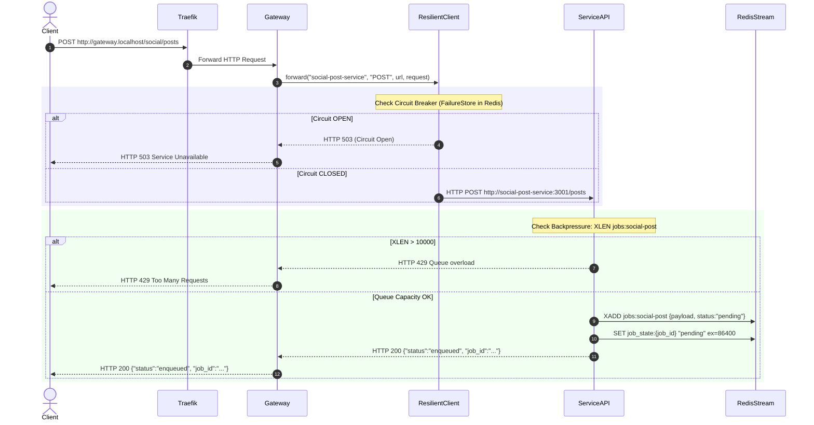
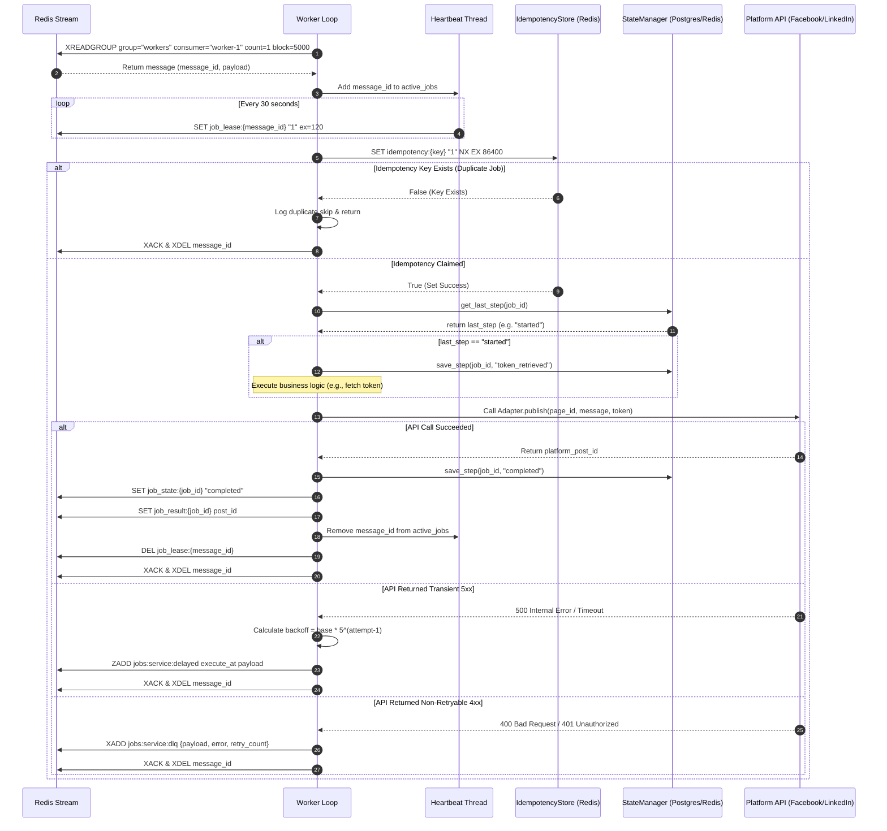

# Request Flow & Execution Pathways

## Purpose
This document provides a detailed trace of synchronous HTTP ingestion and asynchronous background job execution pathways across the **AD. Publish** platform.

---

## 1. Synchronous HTTP Ingestion Flow

---

## 2. Asynchronous Worker Execution & State Checkpointing Flow

---

## Step-by-Step Code Path Reference

1. **Client Request Submission**:
   - `gateway/app/routes/v1/social_posts.py`: `create_social_post()` invokes `_forward("POST", "http://social-post-service:3001/posts", json=request.model_dump())`.
   - `gateway/app/http_client.py`: `forward()` creates a `FailureStore` key in Redis, executes `ResilientHttpClient.request()`, checks sliding window failures, and proxies HTTP call.

2. **Job Enqueueing & Backpressure**:
   - `services/social-post-service/main.py`: `create_post()` executes `redis_client.xlen("jobs:social-post")`. If `> 10000`, returns HTTP 429. Otherwise calls `RedisQueue.enqueue()` (`XADD jobs:social-post`) and initializes `job_state:{job_id}` to `"pending"`.

3. **Worker Stream Consumption**:
   - `services/shared/shared/worker.py`: `Worker.run()` starts background daemon thread `_heartbeat_loop()`. Main thread enters infinite loop executing `RedisQueue.read_jobs()` (`XREADGROUP group="workers" consumer="hostname"`).

4. **Lease Maintenance**:
   - `Worker._heartbeat_loop()` iterates active job message IDs every 30s, calling `redis.set(f"job_lease:{message_id}", "1", ex=120)`.

5. **Step Execution & Checkpointing**:
   - `services/social-publish-service/worker.py`: `handle_publish_post()` queries `StateManager.get_last_step(job_id)`. If step is incomplete, retrieves platform access token, saves milestone `token_retrieved`, and executes selected `SocialPlatformAdapter.publish()`.

6. **State Completion & Teardown**:
   - Worker writes `job_state:{job_id}` = `"completed"`, writes `job_result:{job_id}` = `post_id`, removes job from `self.active_jobs`, deletes `job_lease:{message_id}`, and issues `XACK` + `XDEL` to Redis Stream.
