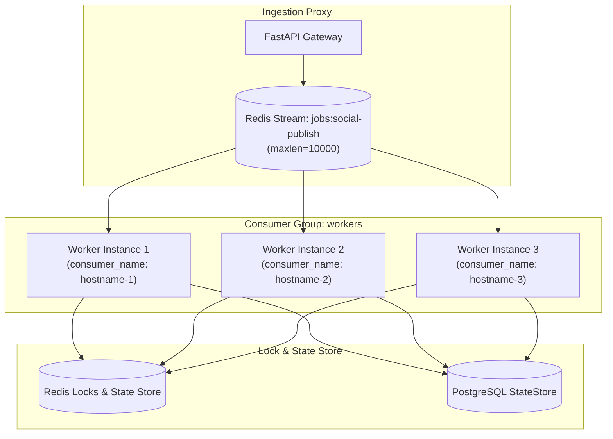

# Scaling Model & Concurrency Dynamics

## Purpose
This document explains the horizontal scaling model, partition mechanics, and concurrency bounds of **AD. Publish**.

---

## Consumer Group Scaling Dynamics

Scaling asynchronous processing in **AD. Publish** relies on Redis Streams Consumer Groups (`workers`).



### Stream Partitioning & Message Allocation
- Every service stream (`jobs:identity`, `jobs:social-post`, `jobs:social-publish`, `jobs:social-account`) is assigned consumer group `"workers"`.
- When worker processes launch, they generate a unique `consumer_name` based on system hostname (`socket.gethostname()`).
- Multiple worker instances issue `XREADGROUP group="workers" consumer={name} streams={stream} > count=1 block=5000`.
- Redis Stream engine automatically partitions unacknowledged messages across active workers. No message is delivered to two active workers simultaneously in the same consumer group.

---

## Concurrency Bounds & Resource Bottlenecks

### 1. Ingestion Layer Bottlenecks
- **FastAPI Gateway Overhead**: Non-blocking async IO permits thousands of concurrent proxy connections. Bound primarily by CPU limits (0.25 CPU per container).
- **Queue Length Cap**: `Social Post Service` caps total stream length at 10,000 items (`xlen > 10000`). When exceeded, Gateway returns HTTP 429 to prevent Redis memory exhaustion.

### 2. Database Connection Pooling (`StateManager`)
- `StateManager` in `services/shared/shared/utils.py` uses synchronous `psycopg2` calls per step update:
  ```sql
  INSERT INTO job_execution_state (job_id, last_step, updated_at)
  VALUES (%s, %s, CURRENT_TIMESTAMP)
  ON CONFLICT (job_id) DO UPDATE 
  SET last_step = EXCLUDED.last_step, updated_at = EXCLUDED.updated_at;
  ```
- **Concurrency Scaling Bound**: Under high worker horizontal scaling (N > 50 workers), direct `psycopg2.connect()` calls introduce PostgreSQL connection overhead. If PostgreSQL connection capacity is saturated, `StateManager` automatically falls back to Redis key `job_state:{job_id}` without failing the job.

### 3. Redis Single-Threaded Key Lock Contention
- Atomic key creation (`SET NX`) for idempotency (`idempotency:{key}`) and leases (`job_lease:{message_id}`) executes in `O(1)` time.
- Redis memory is bounded by stream trimming (`maxlen=10000`) and 24-hour key TTLs (`ex=86400`).

---

## Horizontal Scaling Strategy

| Subsystem | Scaling Vector | Bottleneck Indicator | Scaling Action |
| :--- | :--- | :--- | :--- |
| **API Gateway** | Horizontal (Replicas) | High CPU utilization, high p95 response time | Scale Gateway container replicas behind Traefik load balancer. |
| **Redis Stream Workers** | Horizontal (Process Instances) | High pending entry count in stream, increasing job latency | Spin up additional worker containers sharing the consumer group name (`workers`). |
| **PostgreSQL Database** | Vertical / Connection Pooler | Postgres `too many clients` errors, step write timeouts | Implement PgBouncer connection pooler or rely on Redis fallback. |
| **Social API Downstream** | Rate Limiter Throttling | High `RateLimitExceeded` exceptions | Adjust `RateLimiter` sliding window parameters or add platform credentials. |
