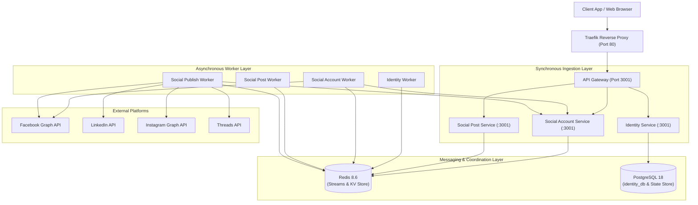

# System Overview

## Purpose
**AD. Publish** is a distributed asynchronous job execution and state coordination engine designed specifically for publishing operations that interact with external third-party APIs (e.g., Facebook Graph API, LinkedIn UGC API, Instagram Containers, Threads API). The primary architectural goal is to ensure high fault tolerance, deterministic recovery, and exact side-effect isolation when operating under network partitions, downstream API rate limits, and worker node crashes.

## Responsibilities
The system is divided into an API Gateway layer, isolated microservices with domain databases, a shared distributed execution library, and a Redis Streams transport pipeline.

1. **API Gateway (`gateway/app/`)**:
   - Acts as the unified edge proxy handling client ingestion.
   - Forwards HTTP traffic via `forward()` in `http_client.py` using `ResilientHttpClient`.
   - Manages service resilience via a Redis-backed sliding window circuit breaker (`FailureStore`).
   - Dynamically aggregates OpenAPI specifications from downstream services using `openapi_merger.py`.
   - Exposes Dead Letter Queue (DLQ) inspection and replay management routes (`routes/v1/dlq.py`).

2. **Identity Service (`services/identity-service/`)**:
   - Manages user registrations and user accounts.
   - Persists entity relational state to PostgreSQL (`identity_db`) using SQLAlchemy 2.0 AsyncSession.
   - Runs `identity-worker` consuming from `jobs:identity` Redis Stream to handle asynchronous user creation events.

3. **Social Account Service (`services/social-account-service/`)**:
   - Manages social channel platform credentials and page profile linkages.
   - Persists account records (`accounts:<id>`) and encrypted/raw tokens (`token:<provider>:<page_id>`) in Redis.
   - Runs `social-account-worker` consuming from `jobs:social-account` to asynchronously validate platform access tokens against external APIs with rate-limit protection (`RateLimiter`).

4. **Social Post Service (`services/social-post-service/`)**:
   - Serves post creation requests.
   - Applies queue backpressure by checking Redis stream size (`XLEN jobs:social-post > 10000` returns HTTP 429).
   - Initializes job status in Redis (`job_state:{job_id} = pending`).
   - Runs `social-post-worker` consuming from `jobs:social-post`. Employs `StateManager` to track progress checkpoints (`started` -> `db_stored` -> `published_event`) before dispatching publish jobs to `jobs:social-publish`.

5. **Social Publish Service (`services/social-publish-service/`)**:
   - Executes publishing operations against third-party social media platform APIs.
   - Runs `social-publish-worker` consuming from `jobs:social-publish`.
   - Utilizes the Strategy Pattern via platform adapters (`FacebookAdapter`, `LinkedInAdapter`, `InstagramAdapter`, `ThreadsAdapter`).
   - Handles multi-step execution (`started` -> `token_retrieved` -> `completed`) and writes platform post IDs (`job_result:{job_id}`) upon success.

6. **Shared Engine (`services/shared/shared/`)**:
   - `RedisQueue`: Manages Redis Streams (`XADD`, `XREADGROUP`, `XACK`, `XDEL`, DLQ stream routing).
   - `Worker`: Core worker daemon handling heartbeat leases, exponential backoff retries via delayed ZSET, and `XAUTOCLAIM` stalled job recovery.
   - `IdempotencyMiddleware`: Atomic deduplication using Redis `SET NX EX`.
   - `StateManager`: Step checkpoint persistence with PostgreSQL `job_execution_state` table and Redis key fallback.
   - `FailureSimulator`: Injected failure simulator for dev/testing environments.

---

## Architecture Diagram

---

## Technical Details & Implementation

### Circuit Breaker & Resilience Settings (`gateway/app/http_client.py`)
- **Sliding Window**: Time-based, window size 10 seconds.
- **Minimum Calls**: 5 calls before evaluating failure threshold.
- **Failure Threshold**: 50% failure rate triggers `OPEN` state.
- **Cooldown Period**: 30 seconds before transitioning to `HALF_OPEN`.
- **Half-Open Thresholds**: Requires 2 successful calls out of 3 max calls to close circuit.
- **Monitored HTTP Statuses**: Retry on `{408, 429, 500, 503}`; trip circuit on `{500, 503}`.

### Distributed Execution Parameters (`services/shared/shared/worker.py`)
- **Worker Consumer Group**: `"workers"`.
- **Max Retries**: Default 5 attempts.
- **Backoff Formula**: `base_backoff * (backoff_multiplier ^ (attempt - 1))` where `base_backoff=1.0` and `multiplier=5.0` (Schedules: 1s, 5s, 25s, 125s).
- **Lease Heartbeat**: 30-second interval refreshing `job_lease:{message_id}` key with 120s TTL (`ex=120`).
- **Autoclaim Interval**: 60-second periodic poll using `XAUTOCLAIM` with a 5-minute idle threshold (`300000` ms).

---

## Failure Scenarios & Recovery Behavior

| Scenario | System Impact | Recovery Path |
| :--- | :--- | :--- |
| **Worker process crashes during execution** | Lease heartbeat stops; `job_lease:{message_id}` expires in Redis after 120s. | Another active worker calls `XAUTOCLAIM` after 5 minutes, detects expired lease, re-claims job from PEL, reads last checkpoint via `StateManager`, and resumes from uncompleted step. |
| **Transient downstream API 5xx / timeout** | Worker catches exception, classifies as retryable. | Worker acknowledges stream message (`XACK` + `XDEL`), computes exponential backoff, inserts job payload into Redis ZSET (`jobs:{service}:delayed`) with score `execute_at`. Worker's delayed queue loop moves job back to main stream when ready. |
| **Non-retryable downstream API 4xx error** | Worker catches `NonRetryableError` or exceeds max retries (5). | Worker invokes `RedisQueue.dlq_job()`, pushing payload, error message, and retry count to `jobs:{service}:dlq`, then acknowledges original message. |
| **High system load / queue backup** | Stream length exceeds 10,000 messages. | `Social Post Service` rejects new incoming POST requests with HTTP 429 (`Queue overload`). Gateway circuit breaker trips to `OPEN` if downstream error rate exceeds 50%. |

---

## Tradeoffs & Limitations

1. **At-Least-Once Delivery**: Prioritizes job completion durability over strict single execution. Demands application-level idempotency via `IdempotencyMiddleware`.
2. **Synchronous `psycopg2` in `StateManager`**: Uses synchronous PostgreSQL connection calls inside worker processing threads. If PostgreSQL latency spikes, worker loop throughput is directly impacted (mitigated by fallback to Redis).
3. **Single Redis Instance**: Current deployment topology uses a single Redis node for streams, locks, and idempotency state. Redis failure results in job queue unavailability until container restart.

---

## Future Improvements
- Implement Redis Sentinel / Cluster HA deployment for high availability.
- Migrate `StateManager` to async driver (`asyncpg`) to avoid blocking worker thread execution.
- Implement dynamic worker concurrency auto-scaling based on Redis stream length and consumer lag.
