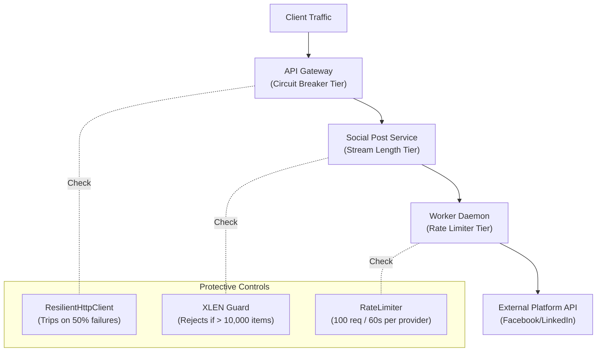

# Backpressure & Load Control Mechanisms

## Purpose
This document specifies the multi-tiered backpressure, queue capacity monitoring, rate limiting, and circuit breaking mechanisms implemented in **AD. Publish**.

---

## Multi-Tiered Backpressure Architecture

Without backpressure protections, sudden spikes in traffic or downstream API outages can cause memory exhaustion in Redis, client HTTP connection saturation, or cascaded microservice failures.



---

## 1. Queue Length Backpressure (`services/social-post-service/main.py`)

Before accepting and enqueueing a new social post job, `Social Post Service` measures the total pending size of the Redis Stream using `XLEN`:

```python
q_len = redis_client.xlen("jobs:social-post")
if q_len > 10000:
    raise HTTPException(status_code=429, detail="Queue overload, please try again later")
```

- **Threshold**: Hard cap at 10,000 unacknowledged stream messages.
- **HTTP Response**: `HTTP 429 Too Many Requests`.
- **Protection Scope**: Prevents Redis RAM exhaustion and keeps worker queue latency bounded.

---

## 2. Gateway Circuit Breaker (`gateway/app/http_client.py`)

The Gateway monitors downstream microservice health using `ResilientHttpClient` with a sliding time window failure tracker (`FailureStore` in Redis):

```python
resilience_config = ResilienceConfig(
    cooldown=30,
    max_retries=3,
    timeout=5.0,
    half_open_max_calls=3,
    half_open_successes_needed=2,
    sliding_window_type="TIME_BASED",
    sliding_window_size=10,
    minimum_number_of_calls=5,
    failure_rate_threshold=50.0,
    retry_status_codes={408, 429, 500, 503},
    circuit_failure_status_codes={500, 503},
)
```

### State Transitions:
1. **CLOSED**: Requests pass through to microservices.
2. **OPEN**: If 50% of the last 5+ requests in a 10-second window fail with HTTP 500/503, the circuit trips `OPEN`. All incoming requests immediately return `HTTP 503 Service Unavailable` (`circuit_open`) without hitting downstream network sockets.
3. **HALF-OPEN**: After a 30-second cooldown, the circuit allows 3 test calls. If 2 succeed, state resets to `CLOSED`; otherwise, it returns to `OPEN`.

---

## 3. Platform Rate Limiting (`services/shared/shared/utils.py`)

`RateLimiter` enforces sliding-window frequency limits before issuing HTTP requests to third-party APIs:

```python
class RateLimiter:
    def __init__(self, redis_client: Redis, max_requests: int, window_seconds: int):
        self.redis = redis_client
        self.max_requests = max_requests
        self.window_seconds = window_seconds

    def is_allowed(self, key: str) -> bool:
        redis_key = f"ratelimit:{key}"
        current = self.redis.incr(redis_key)
        if current == 1:
            self.redis.expire(redis_key, self.window_seconds)
        if current > self.max_requests:
            return False
        return True
```

- **Social Account Worker Threshold**: Max 100 requests per 60-second window per provider (`api:{provider}`).
- **Enforcement Action**: Raises `RateLimitExceeded` exception, triggering worker exponential retry backoff.

---

## Summary of Backpressure Behaviors

| Trigger Point | Monitored Metric | Threshold | System Reaction |
| :--- | :--- | :--- | :--- |
| **Edge Ingestion** | Stream size (`XLEN`) | `> 10,000` items | `HTTP 429` Queue Overload response to client. |
| **Microservice Proxy** | Downstream HTTP failures | `> 50%` failure rate | Gateway Circuit Breaker trips `OPEN` (`HTTP 503`). |
| **Worker Downstream Call**| API requests per minute | `> 100` req / 60s | Throws `RateLimitExceeded`; job scheduled to delayed ZSET. |
