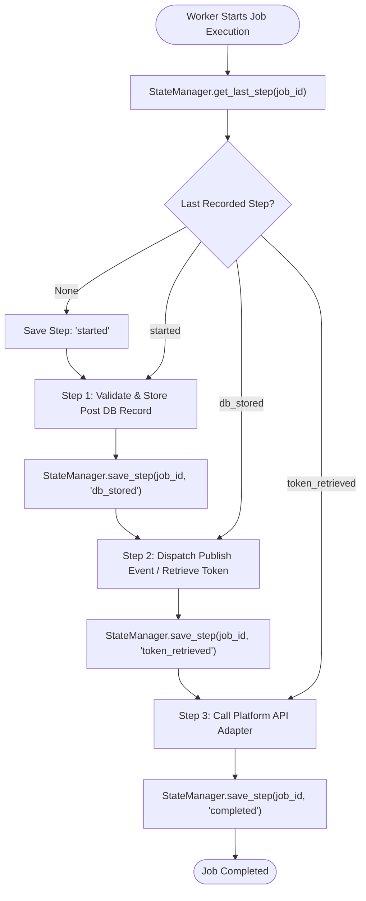

# Step Checkpointing & Partial Recovery

## Purpose
This document specifies the progress persistence mechanism (`StateManager`), milestone step tracking, and partial execution resume logic used in **AD. Publish** to prevent re-executing completed side-effects during retries.

---

## The Partial Pipeline Recovery Problem

Multi-step job execution (e.g., Validate Payload $\rightarrow$ Store Post Record $\rightarrow$ Retrieve Token $\rightarrow$ Call Facebook API $\rightarrow$ Write Result) is vulnerable to mid-pipeline crashes. If a job fails or restarts at Step 4, executing from Step 1 wastes bandwidth, duplicates database entries, and risks duplicate external API calls.

---

## StateManager Architecture (`services/shared/shared/utils.py`)

`StateManager` provides durable milestone persistence for every `job_id`.



---

## Technical Implementation & Persistence Schemes

### 1. PostgreSQL Relational Persistence (`job_execution_state`)
When `DATABASE_URL` is available and `psycopg2` is installed, `StateManager` initializes and writes to PostgreSQL:

```sql
CREATE TABLE IF NOT EXISTS job_execution_state (
    job_id VARCHAR(255) PRIMARY KEY,
    last_step VARCHAR(255) NOT NULL,
    updated_at TIMESTAMP DEFAULT CURRENT_TIMESTAMP
);
```

#### Atomic Step Upsert:
```sql
INSERT INTO job_execution_state (job_id, last_step, updated_at)
VALUES (%s, %s, CURRENT_TIMESTAMP)
ON CONFLICT (job_id) DO UPDATE 
SET last_step = EXCLUDED.last_step, updated_at = EXCLUDED.updated_at;
```

### 2. Redis Key Fallback (`job_state:{job_id}`)
If PostgreSQL writes fail or `DATABASE_URL` is unconfigured, `StateManager` transparently falls back to Redis:
- Key: `job_state:{job_id}`
- Value: `{step_name}`
- TTL: 24 Hours (`ex=86400`)

---

## Step Progression Reference Table

| Service | Pipeline Step Name | Operation Performed | Side-Effect Isolation Behavior |
| :--- | :--- | :--- | :--- |
| **Social Post Worker** | `started` | Initialized state, checked idempotency key | Sets `job_state:{job_id}` = `"processing"`. |
| | `db_stored` | Saved post record to database (`post_db_id`) | Prevents creating duplicate database rows on retry. |
| | `published_event` | Enqueued publish job into `jobs:social-publish` | Delegates platform execution to Publish Service. |
| **Social Publish Worker** | `started` | Idempotency lock acquired | Initializes processing state. |
| | `token_retrieved` | Fetched access token from Account Service & cached | Caches token in `job_token:{job_id}` for next step. |
| | `completed` | Executed platform publish adapter | Writes `job_state:{job_id}` = `"completed"` & `job_result:{job_id}`. |

---

## Operational Advantages & Limitations

### Advantages:
- **Fast Resumptions**: Re-executed jobs instantly skip expensive steps (e.g. database creation or token fetching).
- **Reduced External API Pressure**: Prevents accidental re-posting to social platform APIs.

### Limitations:
- **Synchronous DB Calls**: `psycopg2` connection setup in worker threads adds blocking IO latency (mitigated by fast PostgreSQL indexes on `job_id`).
