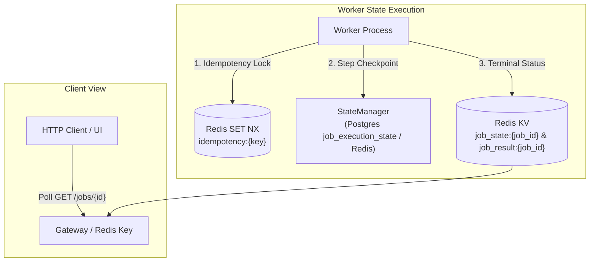

# Consistency Model & State Coordination

## Purpose
This document defines the distributed consistency model, state synchronization rules, and boundary guarantees maintained across **AD. Publish**.

---

## Consistency Model: Eventual Consistency

**AD. Publish** adopts an **Eventual Consistency** model across microservices, background workers, and external social media APIs.

When a client submits a post or account connection request:
1. The Gateway synchronously returns `status: "enqueued"` with a generated `job_id`.
2. The initial job state in Redis is set to `job_state:{job_id} = "pending"`.
3. Worker daemons asynchronously process the stream item, updating state through discrete milestones:
   `pending` -> `processing` -> `started` -> `db_stored` -> `token_retrieved` -> `completed` (or `failed`).

Clients polling `/jobs/{job_id}` read eventually consistent state snapshots until execution reaches a terminal state (`completed` or `failed`).

---

## State Synchronization Architecture



---

## Dual Persistence & Fallback Mechanics (`services/shared/shared/utils.py`)

`StateManager` implements a dual-layer state persistence strategy to ensure state coordination survives database outages:

1. **Primary Layer (PostgreSQL)**:
   - Worker attempts to log completed execution steps into PostgreSQL table `job_execution_state`:
     ```sql
     INSERT INTO job_execution_state (job_id, last_step, updated_at)
     VALUES (%s, %s, CURRENT_TIMESTAMP)
     ON CONFLICT (job_id) DO UPDATE 
     SET last_step = EXCLUDED.last_step, updated_at = EXCLUDED.updated_at;
     ```
2. **Fallback Layer (Redis)**:
   - If PostgreSQL connection fails (or `DATABASE_URL` is undefined), `StateManager` catches the exception and writes to Redis key `job_state:{job_id}` with a 24-hour TTL (`ex=86400`).

---

## State Transition Rules & Invariants

1. **Monotonic Step Progress**: A job's recorded step can only transition forward in sequence. Re-execution of a job reads `get_last_step(job_id)` and skips previously recorded steps.
2. **Terminal Inmutability**: Once a job state reaches `completed` or `failed`, further modifications to `job_state:{job_id}` are prohibited.
3. **Isolation**: Service state stores are strictly separated per domain (`identity_db`, `social_post_db`, `social_account_db`). Cross-service coordination relies exclusively on Redis Stream event payloads.
