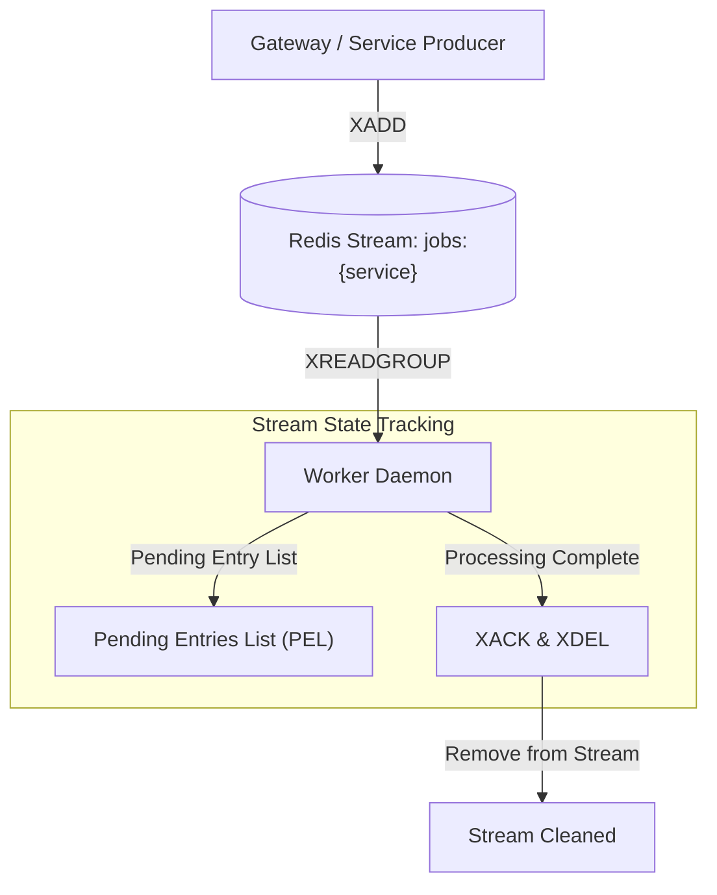

# Delivery Semantics

## Purpose
This document details the message delivery guarantees, queue transport primitives, and consumption contracts implemented across the **AD. Publish** asynchronous execution pipeline.

---

## Guaranteed Delivery Contract: At-Least-Once
**AD. Publish** implements strict **At-Least-Once Delivery** guarantees.

In distributed systems, achieving exactly-once delivery across unreliable networks without heavyweight distributed transactions (e.g. 2PC / Raft) is impossible. **AD. Publish** prioritizes message delivery durability: once a job is accepted by the Gateway and enqueued into Redis Streams (`XADD`), the system guarantees the job will be delivered and processed by a worker at least once.

---

## Implementation Mechanics (`services/shared/shared/`)

### 1. Enqueueing (`queue.py`)
- Producer enqueues payload with `status: "pending"` via `RedisQueue.enqueue()` using `XADD`.
- Redis assigns a unique, monotonically increasing stream ID (e.g. `1721476000000-0`).

### 2. Group Read & Pending State (`queue.py` & `worker.py`)
- Workers call `XREADGROUP group="workers" consumer={consumer_name} streams={stream} >`.
- Redis assigns ownership of the message to `{consumer_name}` and places it into the **Pending Entries List (PEL)**.
- While in the PEL, no other worker in the `"workers"` group will receive this message via standard `>` reads.

### 3. Execution & Explicit Acknowledgment (`worker.py`)
- Upon successful processing (or terminal failure routing to DLQ), the worker explicitly issues:
  1. `XACK stream_name group_name message_id`: Removes the item from the PEL.
  2. `XDEL stream_name message_id`: Removes the message from the stream storage to prevent unbounded stream memory growth.

### 4. Redelivery Scenarios
Redelivery occurs under two specific conditions:
1. **Transient Exception Retry**: Worker catches a retryable exception, computes exponential backoff, acknowledges the current stream message, and re-enqueues the payload to a delayed ZSET. When ready, it is re-injected as a new stream message.
2. **Worker Crash / Failure**: Worker crashes while holding a message in the PEL. The active lease (`job_lease:{message_id}`) expires. After 5 minutes idle time, a peer worker claims the message via `XAUTOCLAIM` and re-executes it.

---

## Application-Level Deduplication Requirement

Because delivery is at-least-once, workers may process the same job payload multiple times (e.g., if a worker crashes right before calling `XACK`). To prevent duplicate side-effects (such as posting twice to Facebook), all worker handlers **MUST** use `IdempotencyMiddleware` (`SET NX`) and `StateManager` step tracking to ensure idempotency.

---

## Tradeoffs & Design Decisions

| Decision | Tradeoff | Rationale |
| :--- | :--- | :--- |
| **At-Least-Once over Exactly-Once** | Demands idempotency locks on workers. | Eliminates complex distributed consensus coordination, providing high execution throughput and resilience under network partitions. |
| **Explicit `XDEL` on Ack** | Stream history is not preserved in Redis stream. | Keeps Redis memory footprint minimal and bounded (`maxlen=10000`). Operational history is preserved in PostgreSQL logs. |
