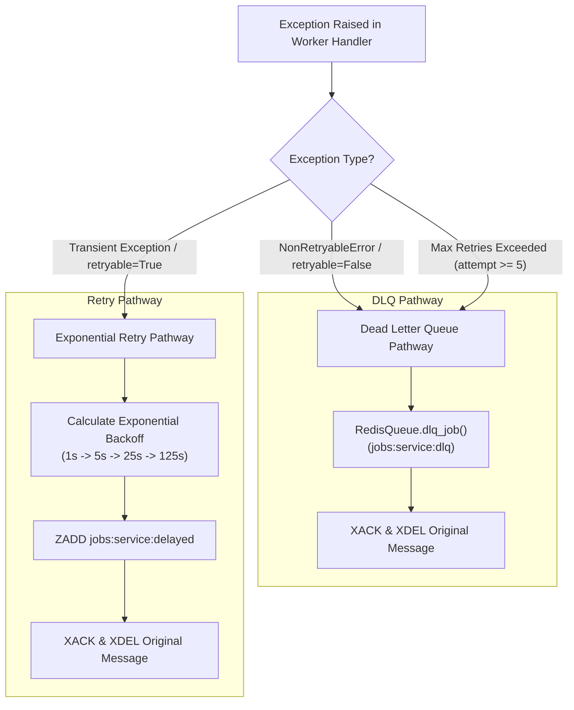

# Exception Classification & Failure Model

## Purpose
This document defines the error classification hierarchy, retryability rules, and failure handling pathways enforced across **AD. Publish**.

---

## Exception Classification Framework

In asynchronous job execution, distinguishing **transient failures** (e.g. network drops, temporary rate limits) from **permanent logical errors** (e.g. invalid JSON payload, revoked access token, bad parameters) is essential to prevent infinite retry loops and worker pool starvation.



---

## Exception Classes (`services/shared/shared/utils.py`)

### 1. `NonRetryableError`
```python
class NonRetryableError(Exception):
    def __init__(self, message="Non-retryable error"):
        self.message = message
        self.retryable = False
        super().__init__(self.message)
```
- **Semantics**: Indicates an unrecoverable validation error, authentication failure, or invalid payload.
- **Handling**: Bypasses backoff scheduling. Worker immediately writes payload, error text, and attempt count to `jobs:{service}:dlq` and acknowledges the stream message.
- **Examples**:
  - Missing `page_id` or `message` in `Social Post Worker`.
  - HTTP 400, 401, 403, or 404 responses from Facebook, LinkedIn, Instagram, or Threads APIs.
  - Unsupported provider name (e.g., `"unsupported_platform"`).
  - Missing social account access token in Redis.

### 2. `RateLimitExceeded`
```python
class RateLimitExceeded(Exception):
    def __init__(self, message="Rate limit exceeded"):
        self.message = message
        self.retryable = True
        super().__init__(self.message)
```
- **Semantics**: Downstream API frequency threshold reached.
- **Handling**: `retryable = True`. Job is scheduled to the delayed ZSET for exponential backoff retry.

### 3. Generic Exceptions (`httpx.RequestError`, `Exception`)
- **Semantics**: Unhandled network socket error, connection timeout, downstream 5xx server error, or database timeout.
- **Handling**: Evaluated as `retryable = getattr(e, "retryable", True)` (defaults to `True`). Standard backoff schedule applies up to `max_retries` (5).

---

## Exception Classification Matrix

| Exception Class | Retryable? | Target Destination | Root Cause Examples |
| :--- | :--- | :--- | :--- |
| `NonRetryableError` | **No** (`False`) | `jobs:{service}:dlq` | HTTP 400 Bad Request, HTTP 401 Unauthorized, missing parameters, invalid JSON. |
| `RateLimitExceeded` | **Yes** (`True`) | `jobs:{service}:delayed` | Provider rate limit exceeded (100 req / 60s). |
| `httpx.HTTPStatusError` (4xx)| **No** (`False`) | `jobs:{service}:dlq` | Invalid token, deleted page, bad media URL. |
| `httpx.HTTPStatusError` (5xx)| **Yes** (`True`) | `jobs:{service}:delayed` | Facebook Graph API 500/503 internal error. |
| `httpx.RequestError` | **Yes** (`True`) | `jobs:{service}:delayed` | DNS lookup failure, TCP connection timeout. |
| Unhandled Worker Exception | **Yes** (`True` until count=5) | `jobs:{service}:delayed` -> DLQ | Transient DB connection drop, unexpected crash. |
