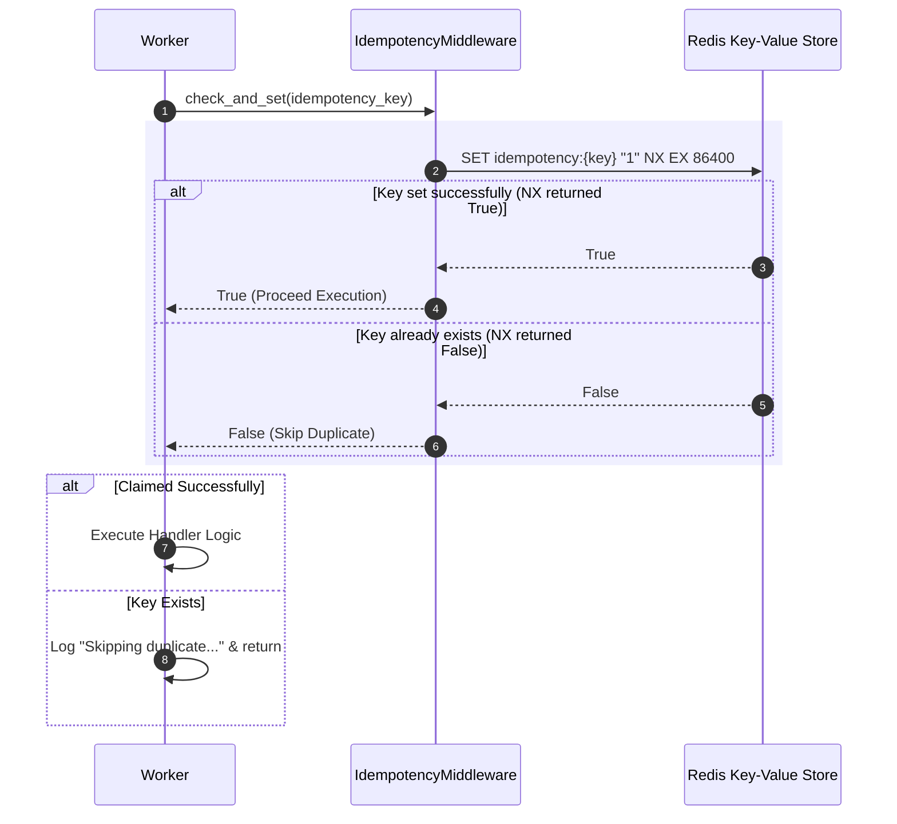

# Idempotency Model & Side-Effect Protection

## Purpose
This document details the implementation, key generation rules, and operational behavior of the idempotency framework (`IdempotencyMiddleware`) in **AD. Publish**.

---

## Idempotency Problem Statement

Because Redis Streams provide **At-Least-Once Delivery**, worker nodes may receive identical job payloads under network retries, worker crash recoveries, or duplicate client HTTP submissions. Without idempotency protection, executing a job twice would result in duplicate side-effects (e.g. creating duplicate social media posts or linking duplicate accounts).

---

## Idempotency Architecture (`services/shared/shared/utils.py`)



---

## Technical Specification

### `IdempotencyMiddleware` Class Definition
Located in `services/shared/shared/utils.py`:

```python
class IdempotencyMiddleware:
    def __init__(self, redis_client: Redis, ttl_seconds: int = 86400):
        self.redis = redis_client
        self.ttl = ttl_seconds

    def check_and_set(self, key: str) -> bool:
        if not key:
            return True  # Skip check if no key provided
        
        redis_key = f"idempotency:{key}"
        result = self.redis.set(redis_key, "1", nx=True, ex=self.ttl)
        return bool(result)

    def clear(self, key: str):
        if key:
            self.redis.delete(f"idempotency:{key}")
```

### Key Formatting Standards Across Services
- **Identity Worker**: `idempotency_key` passed in payload.
- **Social Account Worker**: `f"link:{account_id}"`.
- **Social Post Worker**: `x_idempotency_key` header or generated `uuid4()`.
- **Social Publish Worker**: Derived key `f"pub_{idem_key}"`.

---

## Clearing Idempotency Keys on Failures

If a worker encounters a transient error **before** committing state progress, or if explicit manual replay is required, `idempotency.clear(key)` deletes `idempotency:{key}` from Redis, allowing subsequent retries or DLQ replays to acquire the key cleanly.

---

## Key Parameters & Tradeoffs

| Parameter | Value | Rationale |
| :--- | :--- | :--- |
| **Storage Engine** | Redis Key-Value | Atomic `SET NX` offers sub-millisecond lock acquisition. |
| **TTL Duration** | 24 Hours (`86400` seconds) | Prevents duplicate submissions within a 1-day window while auto-expiring stale keys to conserve memory. |
| **Missing Key Handling** | Evaluates to `True` | Guarantees backwards compatibility for non-critical jobs where clients omit an explicit idempotency key. |
