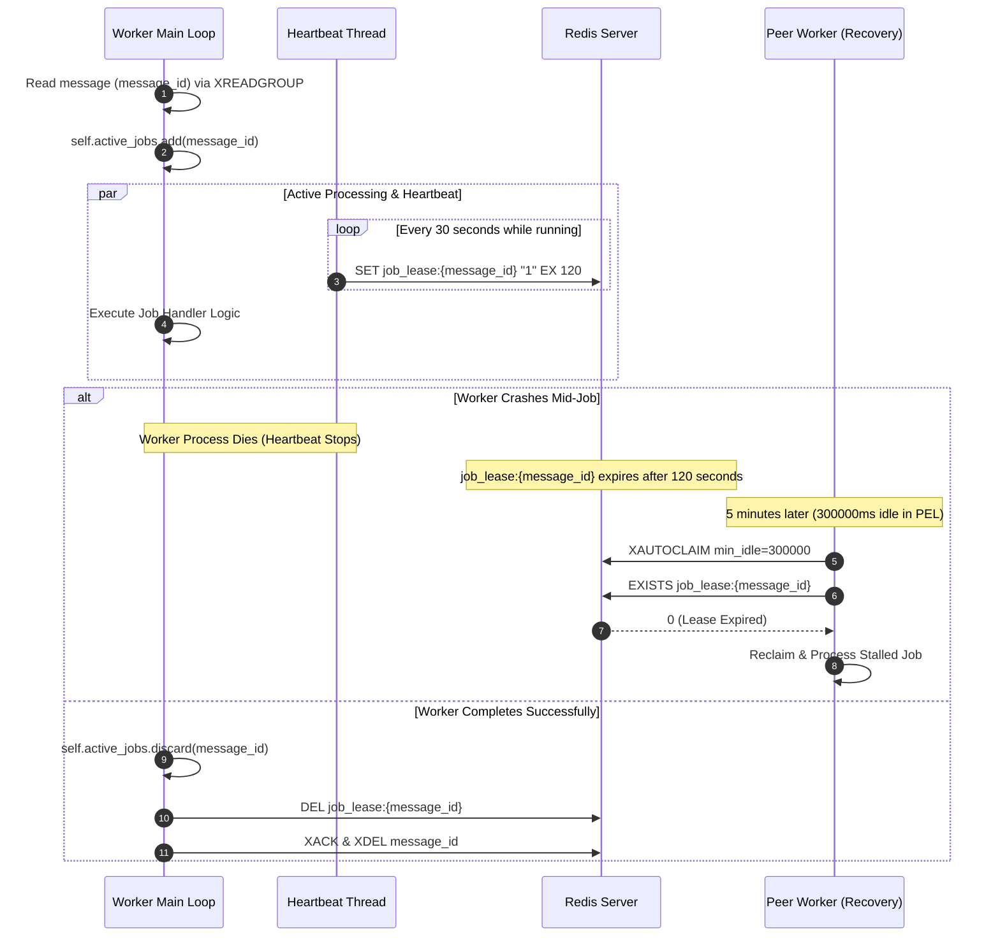

# Distributed Worker Leasing & Lock Management

## Purpose
This document specifies the active worker leasing protocol, background heartbeat loop, and visibility timeout mechanisms that prevent split-brain processing and enable automatic crash recovery in **AD. Publish**.

---

## The Split-Brain & Worker Crash Problem

When a consumer worker claims a message from a Redis Stream using `XREADGROUP`, the message is assigned to that worker in the Pending Entries List (PEL). If the worker process crashes (e.g., `SIGKILL`, OOM, network isolation), the message remains stuck in the PEL indefinitely unless reclaimed.

However, naive recovery mechanisms (such as blindly reclaiming unacknowledged messages after a fixed time) risk **split-brain processing**: if a worker is merely slow (garbage collection, heavy CPU load) rather than dead, another worker might reclaim and execute the job concurrently.

---

## Active Heartbeat Lease Protocol (`services/shared/shared/worker.py`)

To solve split-brain processing, **AD. Publish** combines a **Background Lease Heartbeat Thread** with **`XAUTOCLAIM` Lease Verification**.



---

## Implementation Details (`Worker` class)

### 1. Heartbeat Loop (`_heartbeat_loop`)
```python
def _heartbeat_loop(self):
    while self.running:
        try:
            for message_id in list(self.active_jobs):
                lease_key = f"job_lease:{message_id}"
                self.redis.set(lease_key, "1", ex=120)  # 2 min lease
        except Exception as e:
            logger.error(f"Heartbeat error: {e}")
        time.sleep(30)
```
- **Interval**: Runs every 30 seconds.
- **TTL Duration**: Sets `job_lease:{message_id}` to expire in 120 seconds (`ex=120`).
- **Heartbeat Margin**: Provides a 90-second safety window (120s - 30s) to absorb transient network glitches or short thread delays.

### 2. Lease Verification During Recovery (`_claim_stalled_jobs`)
```python
# Check lease before re-processing an autoclaimed job
lease_key = f"job_lease:{message_id_str}"
if self.redis.exists(lease_key):
    logger.info(f"Job {message_id_str} has active lease. Skipping autoclaim.")
    continue
```
Even if a message has been idle in the PEL for longer than 5 minutes (`300000` ms), the peer worker verifies if `job_lease:{message_id}` exists in Redis. If the key is present, the worker knows the original processing node is still alive and actively heartbeating, so it skips re-execution.

---

## Failure Scenarios & Security Guarantees

| Scenario | Heartbeat Status | Redis Lease Key | Recovery Outcome |
| :--- | :--- | :--- | :--- |
| **Worker Processing Normally** | Active (runs every 30s) | Present (TTL refreshed to 120s) | Job completes; lease deleted on completion. |
| **Worker Process Killed (`SIGKILL`)** | Stopped immediately | Expires after 120s | Peer worker reclaims job via `XAUTOCLAIM` after 5m idle. |
| **Worker Thread Stalled / Slow** | Active (daemon thread continues) | Present | Peer worker detects active lease and skips autoclaim. |
| **Network Partition / Isolated Node** | Active locally, but Redis fails | Expires after 120s | Peer worker reclaims job once network partition heals. |
