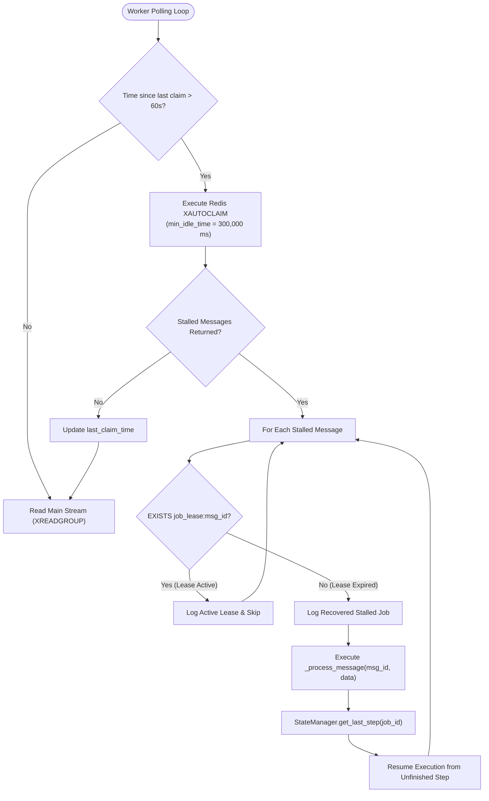

# Autobreaker & Stalled Job Recovery

## Purpose
This document details the recovery protocol executed by worker daemons to reclaim and resume stalled jobs using `XAUTOCLAIM` and lease verification.

---

## Recovery Workflow Mechanics (`services/shared/shared/worker.py`)

When a worker process crashes or experiences hard process termination (`SIGKILL`, node failure, container eviction), any unacknowledged message remains assigned to that worker in the Pending Entries List (PEL).

To reclaim orphaned jobs without manual operator intervention, every active worker periodically executes `_claim_stalled_jobs()`.



---

## Technical Configuration Parameters

```python
def _claim_stalled_jobs(self):
    """Claim jobs that have been stuck in the PEL for over 5 minutes (worker crashed)."""
    try:
        # 300000 ms = 5 minutes idle time
        response = self.redis.xautoclaim(
            self.queue.stream_name,
            self.queue.group_name,
            self.consumer_name,
            300000,
            start_id="0-0",
            count=10
        )
        if response and len(response) >= 2:
            messages = response[1]
            for msg in messages:
                if len(msg) == 2:
                    message_id, data = msg
                    message_id_str = message_id.decode('utf-8')
                    
                    # Check lease before processing
                    lease_key = f"job_lease:{message_id_str}"
                    if self.redis.exists(lease_key):
                        logger.info(f"Job {message_id_str} has active lease. Skipping autoclaim.")
                        continue
                        
                    logger.info(f"Recovered stalled job {message_id_str}")
                    self._process_message(message_id_str, data)
    except Exception as e:
        logger.error(f"Error claiming stalled jobs: {e}")
```

### Parameter Breakdown:
1. **Periodic Check Frequency**: Runs every 60 seconds (`time.time() - self.last_claim_time > 60`).
2. **Min Idle Time**: Sets threshold to `300000` milliseconds (5 minutes). Messages idle in the PEL for under 5 minutes are ignored.
3. **Batch Count**: Reclaims up to 10 stalled messages per claim cycle to bound memory and CPU usage.
4. **Lease Guard Check**: Validates `EXISTS job_lease:{message_id}` in Redis prior to re-executing. If present, the claim is aborted.

---

## Step Resume Integration

When an orphaned job is reclaimed by a peer worker:
1. The peer worker calls `_process_message(message_id, data)`.
2. The handler invokes `StateManager.get_last_step(job_id)`.
3. If PostgreSQL/Redis indicates step `"db_stored"` was already completed prior to the original worker's crash, the new worker skips database insertion and proceeds directly to event dispatching.
