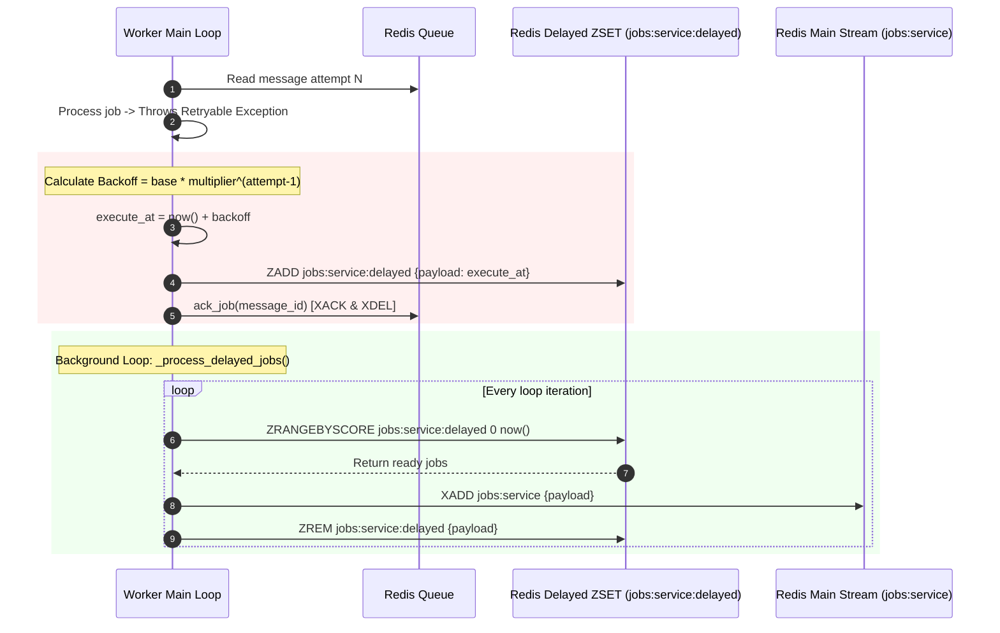

# Deterministic Retry Strategy & Delayed Queue

## Purpose
This document details the retry algorithm, exponential backoff calculation, and Redis Sorted Set (`ZSET`) delayed queue scheduling implemented in **AD. Publish**.

---

## Retry Strategy Overview

When downstream dependencies (e.g., Facebook Graph API, database connections, internal microservices) experience transient failures, issuing immediate retries risks causing **retry storms** that exacerbate system outages.

To mitigate this, **AD. Publish** implements:
1. **Jittered Exponential Backoff**: Exponentially increases delays between successive retry attempts.
2. **Delayed Queue via Redis ZSET**: Offloads retries out of the main Redis Stream to prevent blocking other jobs.
3. **Decoupled Execution Scheduling**: Acknowledges original stream items immediately so workers remain free to ingest new traffic.

---

## Technical Mechanism (`services/shared/shared/worker.py`)



---

## Backoff Calculation & Retry Schedule

The backoff duration is calculated in `Worker.calculate_backoff()`:

$$\text{Backoff Seconds} = \text{base\_backoff} \times (\text{backoff\_multiplier}^{(\text{attempt} - 1)})$$

### Default Worker Parameters:
- `base_backoff` = `1.0` second
- `backoff_multiplier` = `5.0`
- `max_retries` = `5` attempts

### Retry Schedule Progression Table:

| Attempt Number | Formula Calculation | Delay Before Next Attempt | Cumulative Elapsed Time |
| :--- | :--- | :--- | :--- |
| **Attempt 1 (Initial)** | N/A (Immediate) | 0 seconds | 0 seconds |
| **Attempt 2 (Retry 1)** | $1.0 \times 5^0$ | **1 second** | 1 second |
| **Attempt 3 (Retry 2)** | $1.0 \times 5^1$ | **5 seconds** | 6 seconds |
| **Attempt 4 (Retry 3)** | $1.0 \times 5^2$ | **25 seconds** | 31 seconds |
| **Attempt 5 (Retry 4)** | $1.0 \times 5^3$ | **125 seconds** (~2.1 min) | 156 seconds (~2.6 min) |
| **Exceeded (Attempt > 5)**| Retries Exhausted | **Routed to DLQ** | Sent to `jobs:{service}:dlq` |

---

## Delayed Queue Operations

### 1. Scheduling a Retry (`_process_message`)
```python
backoff = self.calculate_backoff(attempt)
execute_at = time.time() + backoff
delayed_key = f"{self.queue.stream_name}:delayed"
self.redis.zadd(delayed_key, {json.dumps(payload): execute_at})
self.queue.ack_job(message_id)  # Remove original message from main stream
```

### 2. Processing Delayed Jobs (`_process_delayed_jobs`)
On every iteration of `Worker.run()`, before blocking for new stream items, the worker queries the ZSET:
```python
ready_jobs = self.redis.zrangebyscore(delayed_key, 0, now)
for payload_bytes in ready_jobs:
    payload = json.loads(payload_bytes.decode("utf-8"))
    self.queue.enqueue(payload)  # Re-inject to main stream via XADD
    self.redis.zrem(delayed_key, payload_bytes)
```

---

## Key Design Benefits & Tradeoffs

- **Non-Blocking Architecture**: High-priority jobs are never stuck behind retrying jobs because retries are removed from the stream PEL and stored in the ZSET.
- **Durable Scheduling**: Because the ZSET is stored in Redis, scheduled retries survive worker process restarts.
- **Eventual Consistency Tradeoff**: Retries introduce execution delay windows, requiring UI clients to poll `/jobs/{job_id}` asynchronously.
