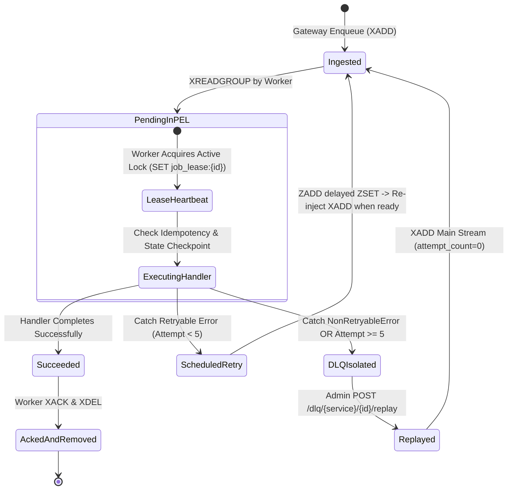

# End-to-End Message Lifecycle

## Purpose
This document tracks the complete state machine and command sequence of a job message from ingestion through stream execution, retry, or DLQ isolation.

---

## Message State Machine Diagram

---

## Stream Command Execution Matrix

| Stage | Redis Command Executed | Key / Target | Description |
| :--- | :--- | :--- | :--- |
| **Ingestion** | `XADD` | `jobs:{service}` | Appends payload, sets `status: "pending"`. Caps stream length at 10,000. |
| **Consumer Read** | `XREADGROUP` | `jobs:{service}` group `workers` | Reads 1 message, moves entry to PEL, assigns ownership to worker. |
| **Lease Refresh** | `SET ... EX 120` | `job_lease:{message_id}` | Maintained every 30s by background thread while job is active. |
| **Idempotency** | `SET ... NX EX 86400` | `idempotency:{key}` | Asserts lock key before executing side-effect handler logic. |
| **Step Checkpoint** | `SQL INSERT / SET` | `job_execution_state` / `job_state:{job_id}` | Persists step progress milestone (`started`, `db_stored`, `completed`). |
| **Retry Backoff** | `ZADD` | `jobs:{service}:delayed` | Adds payload with score = `execute_at` timestamp. |
| **Stream Cleanup** | `XACK` & `XDEL` | `jobs:{service}` | Removes entry from PEL and stream storage. |
| **DLQ Isolation** | `XADD` | `jobs:{service}:dlq` | Appends payload, error string, and attempt count to DLQ stream. |
| **Autoclaim** | `XAUTOCLAIM` | `jobs:{service}` | Reclaims orphaned PEL items idle for > 5 minutes. |
