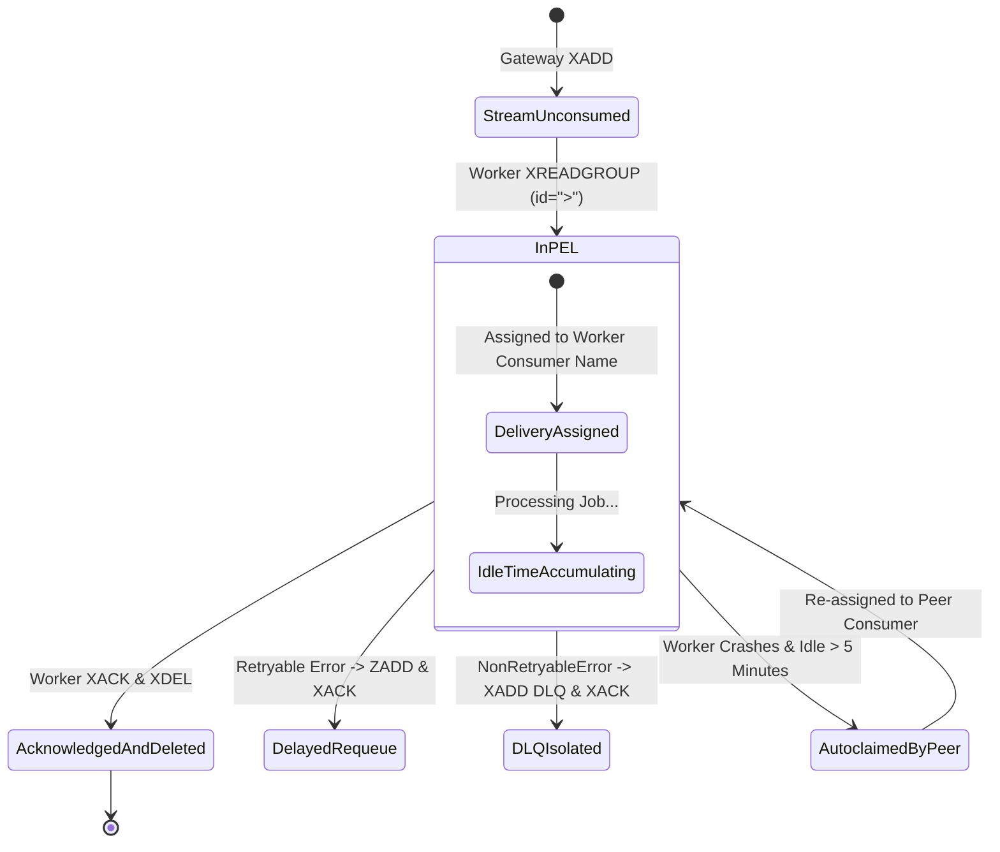

# Pending Entry List (PEL) & Message States

## Purpose
This document details the Pending Entry List (PEL) mechanics, unacknowledged message lifecycle, and memory management rules in **AD. Publish**.

---

## What is the Pending Entry List (PEL)?

In Redis Streams, when a consumer group worker fetches a message using `XREADGROUP`, Redis does not immediately delete the item. Instead, Redis records the message ID in the group's **Pending Entry List (PEL)** along with:
1. The consumer name assigned to the message.
2. The idle time (milliseconds since the message was read).
3. The delivery attempt count.

This pending state ensures that if the consumer crashes before acknowledging completion, the message remains safely tracked in Redis.

---

## PEL Lifecycle Diagram



---

## Transitioning Messages Out of the PEL

Messages are removed from the PEL using `XACK`:

1. **Successful Execution**:
   Worker completes processing $\rightarrow$ calls `self.queue.ack_job(message_id)` $\rightarrow$ executes `XACK stream_name group_name message_id` and `XDEL stream_name message_id`.
2. **Exponential Backoff Retry**:
   Worker encounters retryable exception $\rightarrow$ adds payload to delayed ZSET $\rightarrow$ calls `self.queue.ack_job(message_id)` to remove original item from PEL.
3. **Dead Letter Routing**:
   Worker encounters `NonRetryableError` or max retries (5) $\rightarrow$ writes item to `jobs:{service}:dlq` $\rightarrow$ calls `self.queue.ack_job(message_id)` to clear original item from PEL.

---

## Memory & Operational Considerations

- **Memory Leak Protection**: If workers fail to call `XACK`, the PEL will grow continuously, increasing Redis memory usage.
- **Monitoring PEL Size**: Operators inspect pending items via Redis CLI:
  ```bash
  XPENDING jobs:social-publish workers
  ```
- **Automatic Cleanup**: Stalled PEL entries older than 5 minutes (`300000` ms) are automatically reclaimed and resolved by `_claim_stalled_jobs()`.
