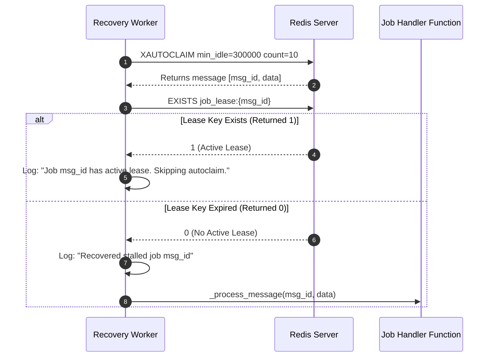

# XAUTOCLAIM Mechanics & Stalled Message Reclaiming

## Purpose
This document specifies the exact parameter configuration, execution workflow, and safety guards governing `XAUTOCLAIM` operations in **AD. Publish**.

---

## Technical Invocation & Code Reference

In `services/shared/shared/worker.py`, `Worker._claim_stalled_jobs()` periodically executes `XAUTOCLAIM`:

```python
response = self.redis.xautoclaim(
    self.queue.stream_name,      # Target stream key (e.g., "jobs:social-publish")
    self.queue.group_name,       # Consumer group name ("workers")
    self.consumer_name,          # Requesting worker ID (e.g., "worker-node-2")
    300000,                      # min_idle_time in ms (5 minutes)
    start_id="0-0",              # Start scanning from beginning of PEL
    count=10                     # Reclaim at most 10 messages per invocation
)
```

---

## Parameter Specification

| Parameter | Value | Rationale |
| :--- | :--- | :--- |
| **`min_idle_time`** | `300000` ms (5 minutes) | Ensures active jobs taking 1–4 minutes are not prematurely reclaimed. |
| **`start_id`** | `"0-0"` | Scans the entire PEL for orphaned messages. |
| **`count`** | `10` | Bounds memory allocation and execution time during large-scale recovery. |
| **Execution Frequency** | Every 60 seconds | Triggered during `Worker.run()` loop (`time.time() - self.last_claim_time > 60`). |

---

## Lease Safety Guard Interaction

Before re-executing an autoclaimed message, `Worker` inspects the active lease key:



This dual check guarantees that if a worker process is slow but still alive (updating its heartbeat every 30s), peer workers will not duplicate execution.
