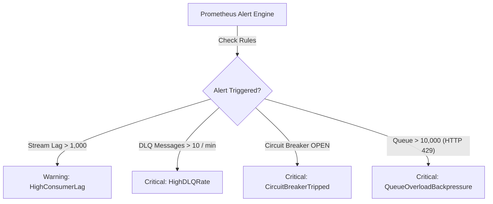

# Alerting Rules & Severity Thresholds

## Purpose
This document specifies the alerting rules, threshold conditions, and notification routes configured for **AD. Publish**.

---

## Prometheus Alert Rules Matrix

---

## Technical Rule Definitions

### 1. Circuit Breaker Tripped (`CircuitBreakerTripped`)
- **Condition**: `resilience_circuit_breaker_state == 1` for $> 1$ minute.
- **Severity**: `CRITICAL`.
- **Impact**: Gateway is actively blocking HTTP traffic to downstream microservices due to $> 50\%$ failure rate.
- **Action**: Inspect downstream microservice logs in Grafana Loki; verify database connectivity.

### 2. High Consumer Lag (`HighConsumerLag`)
- **Condition**: `sum(redis_stream_consumer_group_pending{group="workers"}) > 1000` for $> 5$ minutes.
- **Severity**: `WARNING`.
- **Impact**: Worker consumer capacity is falling behind ingestion rate.
- **Action**: Scale up worker process container instances.

### 3. High Dead Letter Rate (`HighDLQRate`)
- **Condition**: `sum(rate(dlq_messages_total[5m])) > 0.1` for $> 2$ minutes.
- **Severity**: `CRITICAL`.
- **Impact**: Unrecoverable poison messages or revoked API credentials saturating DLQ.
- **Action**: Query `/dlq/{service}` endpoint to inspect failed payloads and error messages.

### 4. Queue Overload Backpressure (`QueueOverloadBackpressure`)
- **Condition**: `redis_stream_length > 10000`.
- **Severity**: `CRITICAL`.
- **Impact**: `Social Post Service` is actively rejecting ingestion with HTTP 429.
- **Action**: Clear stuck PEL items or expand stream maxlen limit if RAM permits.
