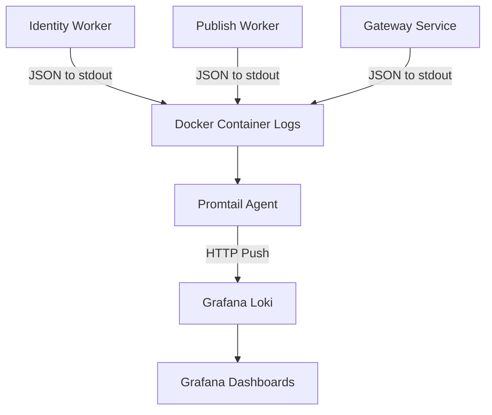

# Structured Logging & Loki Integration

## Purpose
This document specifies the structured JSON logging format, `structlog` configuration, and Loki/Promtail aggregation pipeline in **AD. Publish**.

---

## Log Ingestion Architecture



---

## `structlog` Configuration (`services/shared/shared/telemetry.py`)

All microservices and worker daemons format logs as structured JSON to `stdout`:

```python
import structlog

def setup_logging(service_name: str, level: str = "INFO"):
    structlog.configure(
        processors=[
            structlog.contextvars.merge_contextvars,
            structlog.processors.add_log_level,
            structlog.processors.format_exc_info,
            structlog.processors.TimeStamper(fmt="iso"),
            structlog.processors.JSONRenderer(),
        ],
        wrapper_class=structlog.make_filtering_bound_logger(
            {"DEBUG": 10, "INFO": 20, "WARNING": 30, "ERROR": 40, "CRITICAL": 50}[level.upper()]
        ),
        logger_factory=structlog.PrintLoggerFactory(),
        cache_logger_on_first_use=True,
    )
```

---

## Sample JSON Log Entry Structure

When a job fails or succeeds, workers produce machine-readable JSON logs:

```json
{
  "event": "Job publish_post processed successfully",
  "level": "info",
  "service": "social-publish-worker",
  "job_id": "1721476000000-0",
  "idempotency_key": "pub_4392019a-9e70-4d2b-a81d-2895e638ef12",
  "timestamp": "2026-07-20T11:42:00.123456Z"
}
```

---

## Promtail Scraping Config (`infrastructure/observability/promtail-config.yaml`)

Promtail tails Docker log files at `/var/lib/docker/containers/*/*.log`, extracts container names, and parses JSON fields into Loki labels (`service`, `level`, `job_id`).
