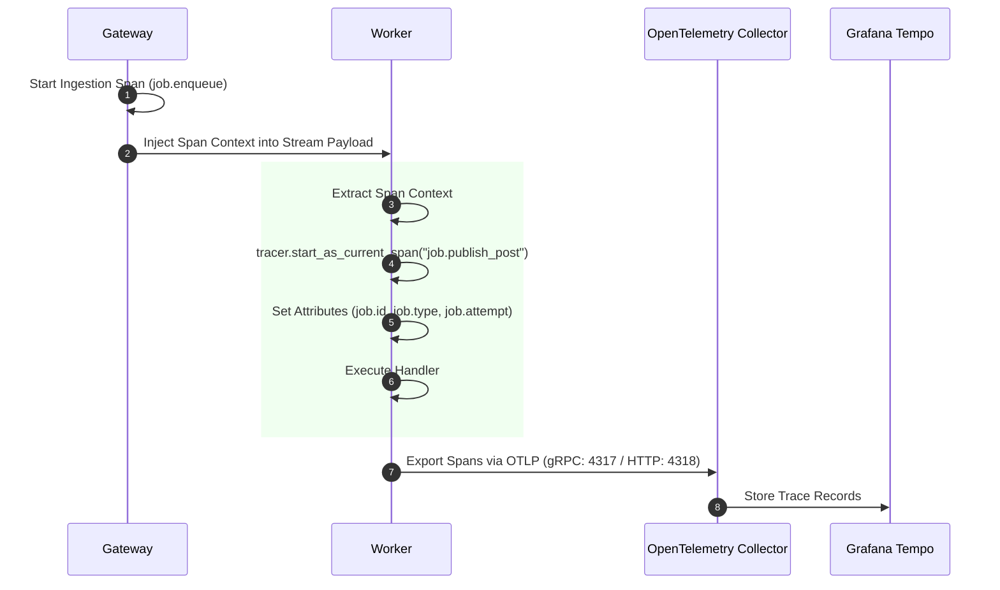

# Distributed Tracing Architecture

## Purpose
This document details the OpenTelemetry context propagation, span creation in worker handlers, Tempo backend integration, and dummy tracer fallback in **AD. Publish**.

---

## Tracing Flow & Context Propagation



---

## OTel Collector Configuration (`infrastructure/observability/otel-collector-config.yaml`)

```yaml
receivers:
  otlp:
    protocols:
      grpc:
        endpoint: 0.0.0.0:4317
      http:
        endpoint: 0.0.0.0:4318

exporters:
  otlp/tempo:
    endpoint: tempo:4317
    tls:
      insecure: true

service:
  pipelines:
    traces:
      receivers: [otlp]
      processors: [batch]
      exporters: [otlp/tempo]
```

---

## Worker Span Instrumentation (`services/shared/shared/worker.py`)

In worker execution loops, job handlers are wrapped in OpenTelemetry spans:

```python
tracer = get_tracer()
t0 = time.monotonic()
with tracer.start_as_current_span(
    f"job.{job_type}",
    kind=None,  # internal span
) as span:
    span.set_attribute("job.type", job_type)
    span.set_attribute("job.id", message_id)
    span.set_attribute("job.attempt", attempt)

    logger.info(f"Processing job {job_type} (id: {message_id}, attempt: {attempt})")
    self.handlers[job_type](payload)
```

---

## Dummy Tracer Fallback (`services/shared/shared/telemetry.py`)

To ensure workers execute reliably even if the OpenTelemetry collector collector is unprovisioned, `telemetry.py` exports a `DummyTracer` context manager that satisfies the OTel API interface with zero runtime overhead:

```python
class DummySpan:
    def __enter__(self): return self
    def __exit__(self, exc_type, exc_val, exc_tb): pass
    def set_attribute(self, key, value): pass

class DummyTracer:
    def start_as_current_span(self, name, *args, **kwargs):
        return DummySpan()

_dummy_tracer = DummyTracer()

def get_tracer():
    return _dummy_tracer
```
