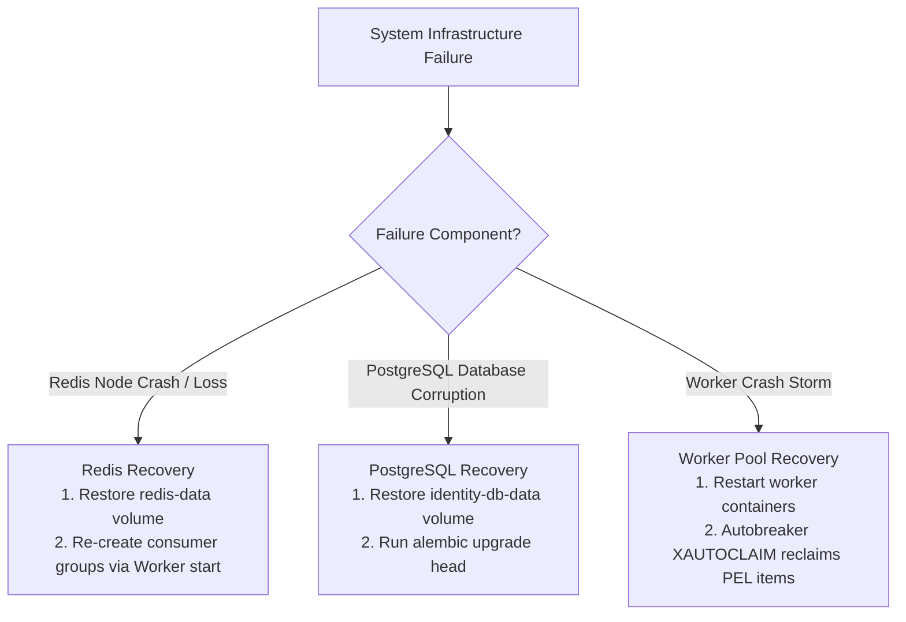

# Disaster Recovery & State Restoration

## Purpose
This document details procedures for restoring data integrity, recovering from corrupted state stores, and restoring stream processing after major infrastructure failures.

---

## Disaster Recovery Matrix



---

## Recovery Playbooks

### 1. Redis Storage Recovery
If the Redis container or volume is corrupted or reset:
1. Restart Redis container:
   ```bash
   docker-compose restart redis
   ```
2. Restart worker daemons. Upon startup, `RedisQueue._ensure_group()` automatically issues `XGROUP CREATE ... MKSTREAM` to rebuild missing stream consumer groups.

### 2. PostgreSQL Relational Recovery
If `identity-db` data volume is lost:
1. Restart database container:
   ```bash
   docker-compose restart identity-db
   ```
2. Execute Alembic schema migrations:
   ```bash
   docker-compose exec identity-service uv run alembic upgrade head
   ```

### 3. Recovering Unacknowledged Jobs in PEL
If worker nodes die leaving jobs unacknowledged:
- No manual intervention is needed. Active peer workers automatically reclaim orphaned PEL entries older than 5 minutes during periodic `XAUTOCLAIM` scans.
