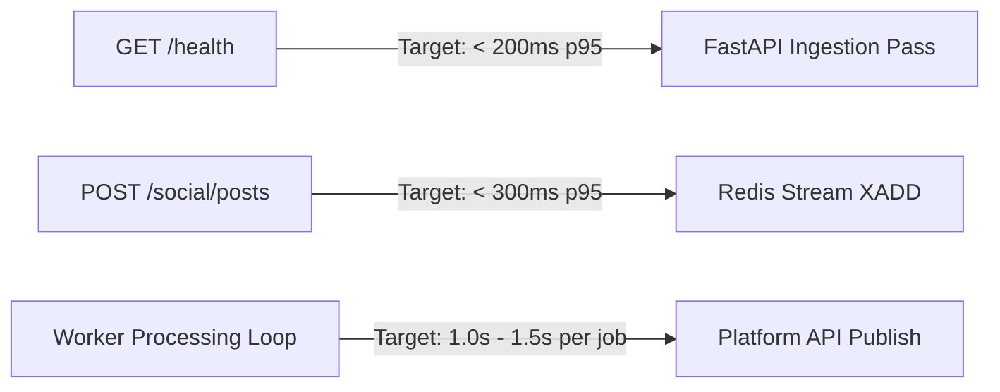

# System Benchmarks & Performance Targets

## Purpose
This document specifies baseline performance metrics, response latency targets, and throughput expectations for **AD. Publish**.

---

## Baseline Performance Targets

---

## Benchmark Metrics Table

| Endpoint / Component | Target Metric | Metric Type | Validation Method |
| :--- | :--- | :--- | :--- |
| **`GET /health`** | < 200ms | p(95) Response Latency | k6 Smoke Test (`smoke-test.js`) |
| **`GET /accounts`** | < 200ms | p(95) Response Latency | k6 Smoke Test (`smoke-test.js`) |
| **`POST /social/posts`** | < 300ms | p(95) Enqueue Latency | k6 Smoke Test (`job_enqueue_duration`) |
| **API Ingestion Rate** | > 500 req/sec | Peak Throughput | k6 Load Test Scenario |
| **Worker Execution Latency** | 1.0s - 1.5s | Average Job Duration | OTel Span Duration (`job.publish_post`) |
| **Error Rate** | < 1.0% | Total Request Failures | k6 `errors` Rate Metric |
