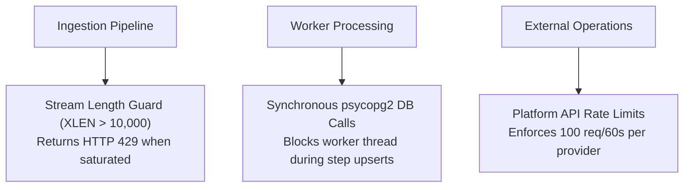

# Identified Bottlenecks & Architectural Constraints

## Purpose
This document analyzes the primary hardware, network, and database bottlenecks identified in the current **AD. Publish** implementation.

---

## Performance Bottlenecks Analysis

---

## Detailed Bottlenecks Breakdown

### 1. Synchronous `psycopg2` Connection Overhead in `StateManager`
- **Location**: `services/shared/shared/utils.py`
- **Impact**: On every step save (`started`, `db_stored`, `completed`), `StateManager` opens a synchronous PostgreSQL connection using `psycopg2.connect()`.
- **Constraint**: Under high concurrency ($> 50$ worker instances), creating synchronous TCP connections to PostgreSQL saturates PostgreSQL's `max_connections` limit.
- **Mitigation**: `StateManager` catches PostgreSQL exceptions and falls back to Redis key writes (`job_state:{job_id}`).

### 2. Single Redis Broker Instance
- **Location**: `infrastructure/docker-compose.yaml`
- **Impact**: All job streams, delayed retry ZSETs, idempotency keys, worker leases, and circuit breaker metrics reside in a single Redis container.
- **Constraint**: Redis single-threaded execution model caps maximum stream throughput per CPU core. Memory is bounded to 256MB.

### 3. Third-Party Social Platform Rate Limits
- **Location**: `services/social-account-service/worker.py`
- **Impact**: External platforms (Facebook Graph API, LinkedIn API) restrict call rates.
- **Constraint**: `RateLimiter` caps worker throughput to 100 requests per 60 seconds per provider, forcing excess jobs into the delayed ZSET.
