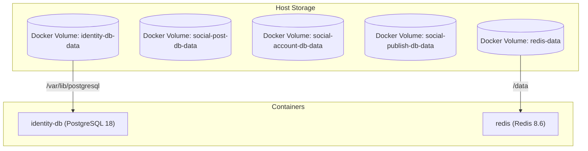

# Data Persistence & Volume Storage Policies

## Purpose
This document specifies the persistence policies, volume mounts, and data durability mechanisms configured for PostgreSQL and Redis in **AD. Publish**.

---

## Data Persistence Topology

---

## PostgreSQL Persistence Configuration

- **Storage Engine**: PostgreSQL 18 (`postgres:18-trixie`).
- **Data Mount**: `/var/lib/postgresql` mounted to persistent named Docker volume `identity-db-data`.
- **Write-Ahead Logging (WAL)**: Uses default WAL settings to guarantee ACID compliance for relational data.

---

## Redis Persistence & Memory Policy

- **Image Version**: `redis:8.6.0-alpine3.23`.
- **Data Mount**: Mounted to Docker volume `redis-data` at `/data`.
- **Restart Policy**: `restart: always`.
- **Durability Guarantees**:
  - Stream entries (`XADD`), delayed ZSET entries (`ZADD`), and KV tokens/leases survive container restarts when saved to disk.
  - Stream length caps (`maxlen=10000`) and key TTLs (`ex=86400`) ensure RAM usage remains bounded within container memory limits (256MB).
