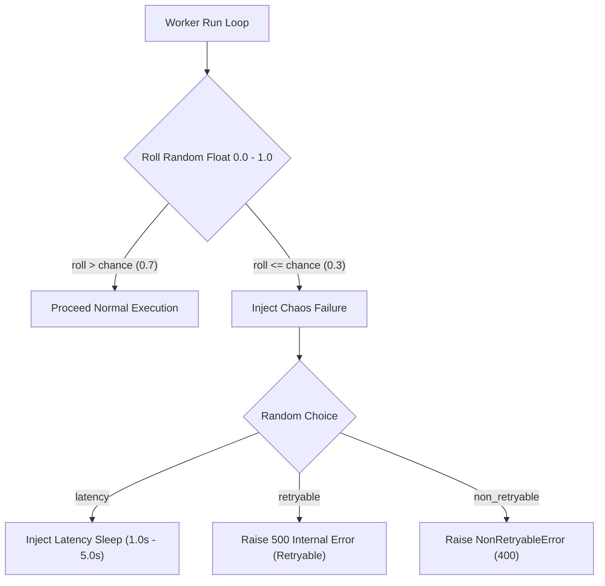

# Chaos Testing & Failure Simulation

## Purpose
This document specifies chaos testing strategies using the embedded `FailureSimulator` to validate recovery pathways under simulated network degradation and error conditions.

---

## Chaos Simulation Architecture (`services/shared/shared/utils.py`)

`FailureSimulator` is embedded in worker execution loops to randomly inject fault conditions into worker code paths.

---

## Fault Types & Injected Behaviors

1. **`latency`**: Executes `time.sleep(random.uniform(1.0, 5.0))`. Validates worker heartbeat thread maintenance and `job_lease:{id}` TTL refreshes under slow execution.
2. **`retryable`**: Raises generic `Exception("Simulated 5xx internal server error")`. Validates exponential backoff retry scheduling into delayed ZSET `jobs:{service}:delayed`.
3. **`non_retryable`**: Raises `NonRetryableError("Simulated Validation Error (400)")`. Validates immediate dead-lettering to `jobs:{service}:dlq` and stream ACK.

---

## Environment Override & Safeguards

> [!WARNING]
> `FailureSimulator` MUST be disabled in production environments. In development and staging environments, it is controlled via worker simulation flags.
