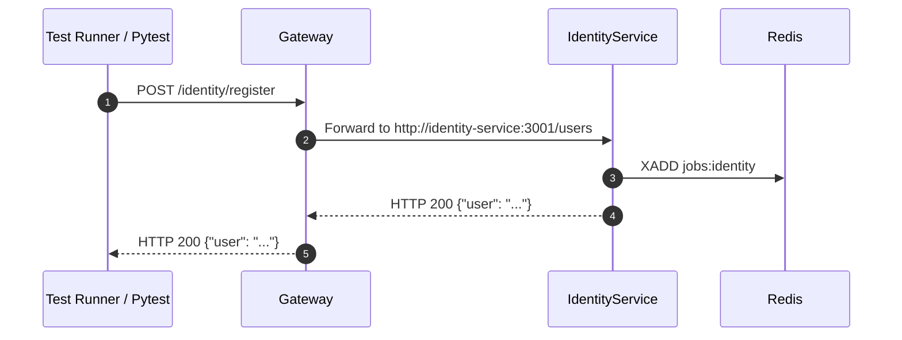

# Integration Testing & Inter-Service Verification

## Purpose
This document details integration testing practices across Gateway proxies, microservice routers, and Redis Streams.

---

## Integration Test Flow

Integration tests verify that HTTP requests submitted to Gateway correctly pass through `ResilientHttpClient`, hit downstream microservice routers, write payloads to Redis Streams, and persist state.



---

## Test Execution Commands

Run pytest inside the gateway container or local venv:

```bash
cd gateway/app
pytest
```
