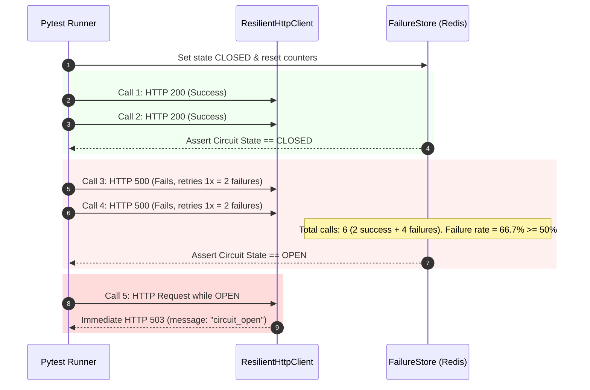

# Reliability & Circuit Breaker Test Suite

## Purpose
This document specifies the automated unit test suite for verifying sliding-window circuit breaker state transitions in `gateway/app/tests/test_circuit_breaker.py`.

---

## Test Suite Design (`test_circuit_breaker.py`)

The test suite validates `ResilientHttpClient` and `FailureStore` against specific failure scenarios using an in-memory or local Redis instance.



---

## Running Reliability Tests

Execute pytest against the test suite:

```bash
cd gateway/app
pytest tests/test_circuit_breaker.py -v
```
