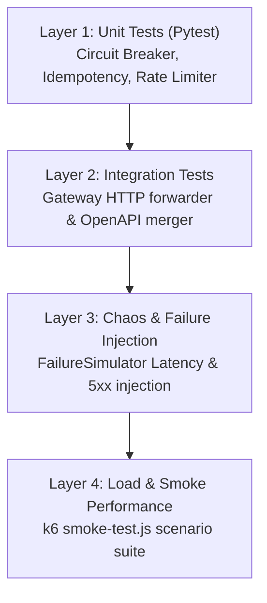

# Testing Strategy & Quality Assurance

## Purpose
This document provides an overview of the multi-layered testing strategy used to ensure reliability, resilience, and operational correctness in **AD. Publish**.

---

## Multi-Layered Testing Pyramid

---

## Testing Level Breakdown

1. **Unit Testing (Pytest)**:
   - Tests individual component behavior in isolation (e.g., sliding window circuit breaker algorithms, idempotency key generation).
   - Executed via `pytest gateway/app/tests/test_circuit_breaker.py`.
2. **Integration Testing**:
   - Validates multi-service communication via Traefik and Gateway proxies.
3. **Chaos & Failure Injection**:
   - Uses `FailureSimulator` to randomly inject simulated latency (1–5s), 500 server errors, and 400 validation failures into worker loops.
4. **Performance & Smoke Testing (k6)**:
   - Automated performance checks validating HTTP response latencies and enqueue speeds.
